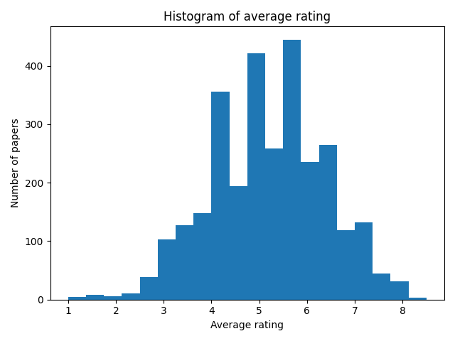
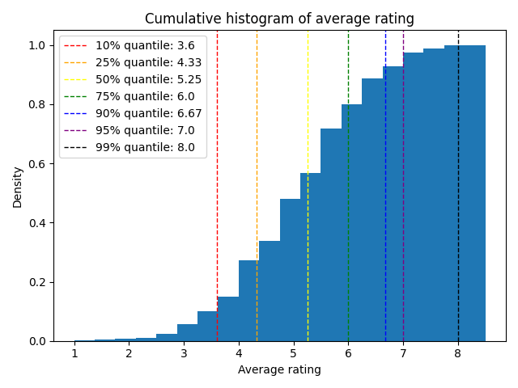

# ICLR 2024 OpenReview Ratings
## Table of contents
- [Rating statistics](#rating-statistics)
- [Top 50 keywords](#top-50-keywords)
- [Speech(or audio)-related paper list (rating >= 6.5)](#speechor-audio-related-paper-list-rating--65)
- [Generative model-related paper list (rating >= 6.5)](#generative-model-related-paper-list-rating--65)
- [Full paper list](#full-paper-list)

## Rating statistics
<table width=250>
<tr>
<th>Quantile</th>
<th>Rating</th>
</tr>

<tr>
<td>10%</td>
<td>3.6</td>
</tr>
<tr>
<td>25%</td>
<td>4.33</td>
</tr>
<tr>
<td>50%</td>
<td>5.25</td>
</tr>
<tr>
<td>75%</td>
<td>6.0</td>
</tr>
<tr>
<td>90%</td>
<td>6.67</td>
</tr>
<tr>
<td>95%</td>
<td>7.0</td>
</tr>
<tr>
<td>99%</td>
<td>8.0</td>
</tr>
</table>

## Top 50 keywords
<table width=250>
<tr>
<th>Keyword</th>
<th>Count</th>
</tr>

<tr>
<td>Large Language Models</td>
<td>318</td>
</tr>
<tr>
<td>Reinforcement Learning</td>
<td>201</td>
</tr>
<tr>
<td>Graph Neural Networks</td>
<td>123</td>
</tr>
<tr>
<td>Diffusion Models</td>
<td>112</td>
</tr>
<tr>
<td>Deep Learning</td>
<td>110</td>
</tr>
<tr>
<td>Representation Learning</td>
<td>107</td>
</tr>
<tr>
<td>Generative Models</td>
<td>86</td>
</tr>
<tr>
<td>Federated Learning</td>
<td>75</td>
</tr>
<tr>
<td>Language Models</td>
<td>74</td>
</tr>
<tr>
<td>Interpretability</td>
<td>66</td>
</tr>
<tr>
<td>Generalization</td>
<td>61</td>
</tr>
<tr>
<td>Transformers</td>
<td>56</td>
</tr>
<tr>
<td>Robustness</td>
<td>51</td>
</tr>
<tr>
<td>Neural Networks</td>
<td>47</td>
</tr>
<tr>
<td>Self-supervised Learning</td>
<td>45</td>
</tr>
<tr>
<td>Contrastive Learning</td>
<td>44</td>
</tr>
<tr>
<td>Transformer</td>
<td>44</td>
</tr>
<tr>
<td>Natural Language Processing</td>
<td>43</td>
</tr>
<tr>
<td>Continual Learning</td>
<td>43</td>
</tr>
<tr>
<td>Optimization</td>
<td>42</td>
</tr>
<tr>
<td>Machine Learning</td>
<td>41</td>
</tr>
<tr>
<td>Fairness</td>
<td>41</td>
</tr>
<tr>
<td>Benchmark</td>
<td>38</td>
</tr>
<tr>
<td>Offline Reinforcement Learning</td>
<td>36</td>
</tr>
<tr>
<td>In-context Learning</td>
<td>35</td>
</tr>
<tr>
<td>Computer Vision</td>
<td>34</td>
</tr>
<tr>
<td>Deep Reinforcement Learning</td>
<td>32</td>
</tr>
<tr>
<td>Adversarial Robustness</td>
<td>31</td>
</tr>
<tr>
<td>Unsupervised Learning</td>
<td>30</td>
</tr>
<tr>
<td>Causal Inference</td>
<td>28</td>
</tr>
<tr>
<td>Explainability</td>
<td>28</td>
</tr>
<tr>
<td>Robotics</td>
<td>27</td>
</tr>
<tr>
<td>Optimal Transport</td>
<td>27</td>
</tr>
<tr>
<td>Pruning</td>
<td>26</td>
</tr>
<tr>
<td>Time Series</td>
<td>26</td>
</tr>
<tr>
<td>Transfer Learning</td>
<td>25</td>
</tr>
<tr>
<td>Imitation Learning</td>
<td>25</td>
</tr>
<tr>
<td>Alignment</td>
<td>25</td>
</tr>
<tr>
<td>Evaluation</td>
<td>24</td>
</tr>
<tr>
<td>Differential Privacy</td>
<td>24</td>
</tr>
<tr>
<td>Fine-tuning</td>
<td>24</td>
</tr>
<tr>
<td>Privacy</td>
<td>24</td>
</tr>
<tr>
<td>Knowledge Distillation</td>
<td>23</td>
</tr>
<tr>
<td>Reasoning</td>
<td>21</td>
</tr>
<tr>
<td>NLP</td>
<td>20</td>
</tr>
<tr>
<td>Foundation Models</td>
<td>20</td>
</tr>
<tr>
<td>Learning Theory</td>
<td>19</td>
</tr>
<tr>
<td>Online Learning</td>
<td>19</td>
</tr>
<tr>
<td>Instruction Tuning</td>
<td>19</td>
</tr>
<tr>
<td>Variational Inference</td>
<td>19</td>
</tr>
</table>

## Speech(or audio)-related paper list (rating >= 6.5)

### [1 / 19] Large Language Models are Efficient Learners of Noise-Robust Speech Recognition

Link: [https://openreview.net/forum?id=ceATjGPTUD](https://openreview.net/forum?id=ceATjGPTUD)

Average rating: 8.0

Ratings: [8, 10, 6, 8]

Keywords: Large language models, automatic speech recognition, generative error correction, noise-robustness

Abstract

> Recent advances in large language models (LLMs) have promoted generative error correction (GER) for automatic speech recognition (ASR), which leverages the rich linguistic knowledge and powerful reasoning ability of LLMs to improve recognition results. The latest work proposes a GER benchmark with "HyPoradise" dataset to learn the mapping from ASR N-best hypotheses to ground-truth transcription by efficient LLM finetuning, which shows great effectiveness but lacks specificity on noise-robust ASR. In this work, we extend the benchmark to noisy conditions and investigate if we can teach LLMs to perform denoising for GER just like what robust ASR do, where one solution is introducing noise information as a conditioner into LLM. However, directly incorporating noise embeddings from audio encoder could harm the LLM tuning due to cross-modality gap. To this end, we propose to extract a language-space noise embedding from the N-best list to represent the noise conditions of source speech, which can promote the denoising process in GER. Furthermore, in order to enhance its representation ability of audio noise, we design a knowledge distillation (KD) approach via mutual information estimation to distill the real noise information in audio embeddings to our language embedding. Experiments on various latest LLMs demonstrate our approach achieves a new breakthrough with up to 53.9% correction improvement in terms of word error rate while with limited training data. Analysis shows that our language-space noise embedding can well represent the noise conditions of source speech, under which off-the-shelf LLMs show strong ability of language-space denoising.

### [2 / 19] Multi-Source Diffusion Models for Simultaneous Music Generation and Separation

Link: [https://openreview.net/forum?id=h922Qhkmx1](https://openreview.net/forum?id=h922Qhkmx1)

Average rating: 8.0

Ratings: [8, 8, 8, 8]

Keywords: source separation, probabilistic diffusion models, music generation

Abstract

> In this work, we define a diffusion-based generative model capable of both music generation and source separation by learning the score of the joint probability density of sources sharing a context. Alongside the classic total inference tasks (i.e., generating a mixture, separating the sources), we also introduce and experiment on the partial generation task of source imputation, where we generate a subset of the sources given the others (e.g., play a piano track that goes well with the drums). Additionally, we introduce a novel inference method for the separation task based on Dirac likelihood functions. We train our model on Slakh2100, a standard dataset for musical source separation, provide qualitative results in the generation settings, and showcase competitive quantitative results in the source separation setting. Our method is the first example of a single model that can handle both generation and separation tasks, thus representing a step toward general audio models.

### [3 / 19] Zipformer: A faster and better encoder for automatic speech recognition

Link: [https://openreview.net/forum?id=9WD9KwssyT](https://openreview.net/forum?id=9WD9KwssyT)

Average rating: 7.5

Ratings: [8.0, 8.0, 6.0, 8.0]

Keywords: Zipformer, ScaledAdam, automatic speech recognition

Abstract

> The Conformer has become the most popular encoder model for automatic speech recognition (ASR).  It adds convolution modules to a transformer to learn both local and global dependencies. In this work we describe a faster, more memory-efficient, and better-performing transformer, called Zipformer.  Modeling changes include: 1) a U-Net-like encoder structure where middle stacks operate at lower frame rates; 2) reorganized block structure with more modules, within which we re-use attention weights for efficiency; 3) a modified form of LayerNorm called BiasNorm allows us to retain some length information; 4)  new activation functions SwooshR and SwooshL work better than Swish.  We also propose a new optimizer, called ScaledAdam, which scales the update by each tensor's current scale to keep the relative change about the same, and also explictly learns the parameter scale. It achieves faster converge and better performance than Adam. Extensive experiments on LibriSpeech, Aishell-1, and WenetSpeech datasets demonstrate the effectiveness of our proposed Zipformer over other state-of-the-art ASR models.

### [4 / 19] An Efficient Membership Inference Attack for the Diffusion Model by Proximal Initialization

Link: [https://openreview.net/forum?id=rpH9FcCEV6](https://openreview.net/forum?id=rpH9FcCEV6)

Average rating: 7.5

Ratings: [8, 8, 6, 8]

Keywords: MIA, Diffusion Model, Text-To-Speech

Abstract

> Recently, diffusion models have achieved remarkable success in generating tasks, including image and audio generation. However, like other generative models, diffusion models are prone to privacy issues. In this paper, we propose an efficient query-based membership inference attack (MIA), namely Proximal Initialization Attack (PIA), which utilizes groundtruth trajectory obtained by $\epsilon$ initialized in $t=0$ and predicted point to infer memberships. Experimental results indicate that the proposed method can achieve competitive performance with only two queries on both discrete-time and continuous-time diffusion models. Moreover, previous works on the privacy of diffusion models have focused on vision tasks without considering audio tasks. Therefore, we also explore the robustness of diffusion models to MIA in the text-to-speech (TTS) task, which is an audio generation task. To the best of our knowledge, this work is the first to study the robustness of diffusion models to MIA in the TTS task. Experimental results indicate that models with mel-spectrogram (image-like) output are vulnerable to MIA, while models with audio output are relatively robust to MIA.

### [5 / 19] Multi-resolution HuBERT: Multi-resolution Speech Self-Supervised Learning with Masked Unit Prediction

Link: [https://openreview.net/forum?id=kUuKFW7DIF](https://openreview.net/forum?id=kUuKFW7DIF)

Average rating: 7.5

Ratings: [8, 6, 8, 8]

Keywords: Speech Representation Learning, Self-supervised Learning, Multi-resolution

Abstract

> Existing Self-Supervised Learning (SSL) models for speech typically process speech signals at a fixed resolution of 20 milliseconds. This approach overlooks the varying informational content present at different resolutions in speech signals. In contrast, this paper aims to incorporate multi-resolution information into speech self-supervised representation learning. We introduce a SSL model that leverages a hierarchical Transformer architecture, complemented by HuBERT-style masked prediction objectives, to process speech at multiple resolutions. Experimental results indicate that the proposed model not only achieves more efficient inference but also exhibits superior or comparable performance to the original HuBERT model over various tasks. Specifically, significant performance improvements over the original HuBERT have been observed in fine-tuning experiments on the LibriSpeech speech recognition benchmark as well as in evaluations using the Speech Universal PERformance Benchmark (SUPERB) and Multilingual SUPERB (ML-SUPERB).

### [6 / 19] NaturalSpeech 2: Latent Diffusion Models are Natural and Zero-Shot Speech and Singing Synthesizers

Link: [https://openreview.net/forum?id=Rc7dAwVL3v](https://openreview.net/forum?id=Rc7dAwVL3v)

Average rating: 7.5

Ratings: [8, 6, 8, 8]

Keywords: text-to-speech, large-scale corpus, non-autoregressive, diffusion

Abstract

> Scaling text-to-speech (TTS) to large-scale, multi-speaker, and in-the-wild datasets is important to capture the diversity in human speech such as speaker identities, prosodies, and styles (e.g., singing). Current large TTS systems usually quantize speech into discrete tokens and use language models to generate these tokens one by one, which suffer from unstable prosody, word skipping/repeating issue, and poor voice quality. In this paper, we develop NaturalSpeech 2, a TTS system that leverages a neural audio codec with residual vector quantizers to get the quantized latent vectors and uses a diffusion model to generate these latent vectors conditioned on text input. To enhance the zero-shot capability that is important to achieve diverse speech synthesis, we design a speech prompting mechanism to facilitate in-context learning in the diffusion model and the duration/pitch predictor. We scale NaturalSpeech 2 to large-scale datasets with 44K hours of speech and singing data and evaluate its voice quality on unseen speakers. NaturalSpeech 2 outperforms previous TTS systems by a large margin in terms of prosody/timbre similarity, robustness, and voice quality in a zero-shot setting, and performs novel zero-shot singing synthesis with only a speech prompt. Audio samples are available at https://naturalspeech2.github.io/.

### [7 / 19] RTFS-Net: Recurrent time-frequency modelling for efficient audio-visual speech separation

Link: [https://openreview.net/forum?id=PEuDO2EiDr](https://openreview.net/forum?id=PEuDO2EiDr)

Average rating: 7.5

Ratings: [8, 8, 6, 8]

Keywords: Audio-Visual, Multi-Modal, Time-Frequency-Domain, Speech-Separation, Model-Compression

Abstract

> Audio-visual speech separation methods aim to integrate different modalities to generate high-quality separated speech, thereby enhancing the performance of downstream tasks such as speech recognition. Most existing state-of-the-art (SOTA) models operate in the time domain. However, their overly simplistic approach to modeling acoustic features often necessitates larger and more computationally intensive models in order to achieve SOTA performance. In this paper, we present a novel time-frequency domain audio-visual speech separation method: Recurrent Time-Frequency Separation Network (RTFS-Net), which applies its algorithms on the complex time-frequency bins yielded by the Short-Time Fourier Transform. We model and capture the time and frequency dimensions of the audio independently using a multi-layered RNN along each dimension. Furthermore, we introduce a unique attention-based fusion technique for the efficient integration of audio and visual information, and a new mask separation approach that takes advantage of the intrinsic spectral nature of the acoustic features for a clearer separation. RTFS-Net outperforms the previous SOTA method using only 10% of the parameters and 18% of the MACs. This is the first time-frequency domain audio-visual speech separation method to outperform all contemporary time-domain counterparts.

### [8 / 19] Masked Audio Generative Modeling

Link: [https://openreview.net/forum?id=Ny8NiVfi95](https://openreview.net/forum?id=Ny8NiVfi95)

Average rating: 7.333333333333333

Ratings: [6, 8, 8]

Keywords: Audio modeling, audio generation, music generation, non-autoregressive models

Abstract

> We introduce MAGNeT, a masked generative sequence modeling method that operates directly over several streams of discrete audio representation, i.e., tokens. Unlike prior work, MAGNeT is comprised of a single-stage, non-autoregressive transformer encoder. During training, we predict spans of masked tokens obtained from the masking scheduler, while during inference we gradually construct the output sequence using several decoding steps. To further enhance the quality of the generated audio, we introduce a novel model rescorer method. In which, we leverage an external pre-trained model to rescore and rank predictions from MAGNeT which will be then used for later decoding steps. Lastly, we explore a hybrid version of MAGNeT, in which we fuse between autoregressive and non-autoregressive models to generate the first few seconds in an autoregressive manner while the rest of the sequence is being decoded in parallel. We demonstrate the efficiency of MAGNeT over the task of text-to-music generation and conduct extensive empirical evaluation, considering both automatic and human studies. We show the proposed approach is comparable to the evaluated baselines while being significantly faster (x7 faster than the autoregressive baseline). Through ablation studies and analysis, we shed light on the importance of each of the components comprising MAGNeT, together with pointing to the trade-offs between autoregressive and non-autoregressive considering latency, throughput, and generation quality. Samples are available as part of the supplemental material.

### [9 / 19] Whole-song Hierarchical Generation of Symbolic Music Using Cascaded Diffusion Models

Link: [https://openreview.net/forum?id=sn7CYWyavh](https://openreview.net/forum?id=sn7CYWyavh)

Average rating: 7.25

Ratings: [8, 5, 8, 8]

Keywords: Cascaded generative models, Diffusion models, Symbolic Music Generation

Abstract

> Recent deep music generation studies have put much emphasis on \textit{music structure} and \textit{long-term} generation. However, we are yet to see high-quality, well-structured whole-song generation. In this paper, we make the first attempt to model a full music piece under the realization of \textit{compositional hierarchy}. With a focus on symbolic representations of pop songs, we define a hierarchical language, in which each level of hierarchy focuses on the context dependency at a certain music scope. The high-level languages reveal whole-song form, phrase, and cadence, whereas the low-level languages focus on notes, chords, and their local patterns. A cascaded diffusion model is trained to model the hierarchical language, where each level is conditioned on its upper levels. Experiments and analysis show that our model is capable of generating full-piece music with recognizable global verse-chorus structure and cadences, and the music quality is higher than the baselines. Additionally, we show that the proposed model is \textit{controllable} in a flexible way. By sampling from the interpretable hierarchical languages or adjusting external model controls, users can control the music flow via various features such as phrase harmonic structures, rhythmic patterns, and accompaniment texture.

### [10 / 19] Listen, Think, and Understand

Link: [https://openreview.net/forum?id=nBZBPXdJlC](https://openreview.net/forum?id=nBZBPXdJlC)

Average rating: 7.0

Ratings: [6, 8, 6, 8]

Keywords: audio processing, large language model

Abstract

> The ability of artificial intelligence (AI) systems to perceive and comprehend audio signals is crucial for many applications. Although significant progress has been made in this area since the development of AudioSet, most existing models are designed to map audio inputs to pre-defined, discrete sound label sets. In contrast, humans possess the ability to not only classify sounds into general categories, but also to listen to the finer details of the sounds, explain the reason for the predictions, think about what the sound infers, and understand the scene and what action needs to be taken, if any. Such capabilities beyond perception are not yet present in existing audio models. On the other hand, modern large language models (LLMs) exhibit emerging reasoning ability but they lack audio perception capabilities. Therefore, we ask the question: can we build a model that has both audio perception and a reasoning ability?

### [11 / 19] Self-Supervised Speech Quality Estimation and Enhancement Using Only Clean Speech

Link: [https://openreview.net/forum?id=ale56Ya59q](https://openreview.net/forum?id=ale56Ya59q)

Average rating: 7.0

Ratings: [6, 8, 6, 8]

Keywords: Self-Supervised Learning, Speech Quality Estimation, Speech Enhancement

Abstract

> Speech quality estimation has recently undergone a paradigm shift from human-hearing expert designs to machine-learning models. However, current models rely mainly on supervised learning, which is time-consuming and expensive for label collection. To solve this problem, we propose VQScore, a self-supervised metric for evaluating speech based on the quantization error of a vector-quantized-variational autoencoder (VQ-VAE). The training of VQ-VAE relies on clean speech; hence, large quantization errors can be expected when the speech is distorted. To further improve correlation with real quality scores, domain knowledge of speech processing is incorporated into the model design. We found that the vector quantization mechanism could also be used for self-supervised speech enhancement (SE) model training. To improve the robustness of the encoder for SE, a novel self-distillation mechanism combined with adversarial training is introduced. In summary, the proposed speech quality estimation method and enhancement models require only clean speech for training without any label requirements. Experimental results show that the proposed VQScore and enhancement model are competitive with supervised baselines. The code will be released after publication.

### [12 / 19] Spoken Question Answering and Speech Continuation Using Spectrogram-Powered LLM

Link: [https://openreview.net/forum?id=izrOLJov5y](https://openreview.net/forum?id=izrOLJov5y)

Average rating: 6.75

Ratings: [5, 6, 8, 8]

Keywords: Speech Continuation, Spoken Question Answering

Abstract

> We present a novel approach to adapting pre-trained large language models (LLMs) to perform question answering (QA) and speech continuation. By endowing the LLM with a pre-trained speech encoder, our model becomes able to take speech inputs and generate speech outputs. The entire system is trained end-to-end and operates directly on spectrograms, simplifying our architecture. Key to our approach is a training objective that jointly supervises speech recognition, text continuation, and speech synthesis using only paired speech-text pairs, enabling a `cross-modal' chain-of-thought within a single decoding pass. Our method surpasses existing spoken language models in speaker preservation and semantic coherence. Furthermore, the proposed model improves upon direct initialization in retaining the knowledge of the original LLM as demonstrated through spoken QA datasets.

### [13 / 19] MERT: Acoustic Music Understanding Model with Large-Scale Self-supervised Training

Link: [https://openreview.net/forum?id=w3YZ9MSlBu](https://openreview.net/forum?id=w3YZ9MSlBu)

Average rating: 6.75

Ratings: [8.0, 8.0, 5.0, 6.0]

Keywords: self-supervised learning, music, audio, language model

Abstract

> Self-supervised learning (SSL) has recently emerged as a promising paradigm for training generalisable models on large-scale data in the fields of vision, text, and speech.  Although SSL has been proven effective in speech and audio, its application to music audio has yet to be thoroughly explored. This is partially due to the distinctive challenges associated with modelling musical knowledge, particularly tonal and pitched characteristics of music. To address this research gap, we propose an acoustic Music undERstanding model with large-scale self-supervised Training (MERT), which incorporates teacher models to provide pseudo labels in the masked language modelling (MLM) style acoustic pre-training. In our exploration, we identified an effective combination of teacher models, which outperforms conventional speech and audio approaches in terms of performance.  This combination includes an acoustic teacher based on Residual Vector Quantization - Variational AutoEncoder (RVQ-VAE) and a musical teacher based on the Constant-Q Transform (CQT).  Furthermore, we explore a wide range of settings to overcome the instability in acoustic language model pre-training, which allows our designed paradigm to scale from 95M to 330M parameters. Experimental results indicate that our model can generalise and perform well on 14 music understanding tasks and attain state-of-the-art (SOTA) overall scores.

### [14 / 19] Weakly-supervised Audio Separation via Bi-modal Semantic Similarity

Link: [https://openreview.net/forum?id=4N97bz1sP6](https://openreview.net/forum?id=4N97bz1sP6)

Average rating: 6.666666666666667

Ratings: [6, 6, 8]

Keywords: Audio-language learning, conditional audio separation, unsupervised learning, weakly supervised learning, semi-supervised learning

Abstract

> Conditional sound separation in multi-source audio mixtures without having access to single source sound data during training is a long standing challenge. Existing mix-and-separate based methods suffer from significant performance drop with multi-source training mixtures due to the lack of supervision signal for single source separation cases during training. However, in the case of language-conditional audio separation, we do have access to corresponding text descriptions for each audio mixture in our training data, which can be seen as (rough) representations of the audio samples in the language modality. That raises the curious question of how to generate supervision signal for single-source audio extraction by leveraging the fact that single-source sounding language entities can be easily extracted from the text description. To this end, in this paper, we propose a generic bi-modal separation framework which can enhance the existing unsupervised frameworks to separate single-source signals in a target modality (i.e., audio) using the easily separable corresponding signals in the conditioning modality (i.e., language), without having access to single-source samples in the target modality during training. We empirically show that this is well within reach if we have access to a pretrained joint embedding model between the two modalities (i.e., CLAP). Furthermore, we propose to incorporate our framework into two fundamental scenarios to enhance separation performance. First, we show that our proposed methodology significantly improves the performance of purely unsupervised baselines by reducing the distribution shift between training and test samples. In particular, we show that our framework can achieve 71% boost in terms of Signal-to-Distortion Ratio (SDR) over the baseline, reaching 97.5% of the supervised learning performance. Second, we show that we can further improve the performance of the supervised learning itself by 17% if we augment it by our proposed weakly-supervised framework. Our framework achieves this by making large corpora of unsupervised data available to the supervised learning model as well as utilizing a natural, robust regularization mechanism through weak supervision from the language modality, and hence enabling a powerful semi-supervised framework for audio separation. Our code base and checkpoints will be released for further research and reproducibility.

### [15 / 19] SALMONN: Towards Generic Hearing Abilities for Large Language Models

Link: [https://openreview.net/forum?id=14rn7HpKVk](https://openreview.net/forum?id=14rn7HpKVk)

Average rating: 6.666666666666667

Ratings: [6.0, 8.0, 6.0]

Keywords: Multimodal large language models, speech and audio processing, music processing

Abstract

> Hearing is arguably an essential ability of artificial intelligence (AI) agents in the physical world, which refers to the perception and understanding of general auditory information consisting of at least three types of sounds: speech, audio events, and music. In this paper, we propose SALMONN, a speech audio language music open neural network, built by integrating a pre-trained text-based large language model (LLM) with speech and audio encoders into a single multimodal model. SALMONN enables the LLM to directly process and understand general audio inputs and achieve competitive performances on a number of speech and audio tasks used in training, such as  automatic speech recognition and translation, auditory-information-based question answering, emotion recognition, speaker verification, and music and audio captioning etc. SALMONN also has a diverse set of emergent abilities unseen in the training, which includes but is not limited to speech translation to untrained languages, speech-based slot filling, spoken question answering, audio-based storytelling,  and speech audio co-reasoning etc. The presence of the cross-modal emergent abilities is studied, and a novel few-shot activation tuning approach is proposed to activate such abilities of SALMONN. To our knowledge, SALMONN is the first model of its type and can be regarded as a step towards AI with generic hearing abilities. An interactive demo of SALMONN is available at https://github.com/the-anonymous-account/SALMONN, and the training code and model checkpoints will be released upon acceptance.

### [16 / 19] Revisiting Deep Audio-Text Retrieval Through the Lens of Transportation

Link: [https://openreview.net/forum?id=l60EM8md3t](https://openreview.net/forum?id=l60EM8md3t)

Average rating: 6.666666666666667

Ratings: [6, 6, 8]

Keywords: Cross-modal, Audio-text Retrieval, Representation Learning

Abstract

> Learning-to-match (LTM) is an effective inverse optimal transport framework for learning the underlying ground metric between two sources of data, which can be further used to form the matching between them. Nevertheless, the conventional LTM framework is not scalable since it needs to use the entire dataset each time updating the parametric ground metric. To adapt the LTM framework to the deep learning setting, we propose the mini-batch learning-to-match (m-LTM) framework for audio-text retrieval problems, which is based on mini-batch subsampling and neural networks parameterized ground metric. In addition, we improve further the framework by introducing the Mahalanobis-enhanced family of ground metrics. Moreover, to cope with the noisy data correspondence problem arising from practice, we additionally propose a variant using partial optimal transport to mitigate the pairing uncertainty in training data.  We conduct extensive experiments on audio-text matching problems using three datasets: AudioCaps, Clotho, and ESC-50. Results demonstrate that our proposed method is capable of learning rich and expressive joint embedding space, which achieves SOTA performance. Beyond this, the proposed m-LTM framework is able to close the modality gap across audio and text embedding, which surpasses both triplet and contrastive loss in the zero-shot sound event detection task on the ESC-50 dataset. Finally, our strategy to use partial OT with m-LTM has shown to be more noise tolerance than contrastive loss under a variant of noise ratio of training data in AudioCaps.

### [17 / 19] It's Never Too Late: Fusing Acoustic Information into Large Language Models for Automatic Speech Recognition

Link: [https://openreview.net/forum?id=QqjFHyQwtF](https://openreview.net/forum?id=QqjFHyQwtF)

Average rating: 6.6

Ratings: [5, 6, 6, 6, 10]

Keywords: Automatic speech recognition, large language model, generative error correction.

Abstract

> Recent studies have successfully shown that large language models (LLMs) can be successfully used for generative error correction (GER) on top of the automatic speech recognition (ASR) output. Specifically, an LLM is utilized to carry out a direct mapping from the N-best hypotheses list generated by an ASR system to the predicted output transcription. However, despite its effectiveness, GER introduces extra data uncertainty since the LLM is trained without taking into account acoustic information available in the speech signal. In this work, we aim to overcome such a limitation by infusing acoustic information before generating the predicted transcription through a novel late fusion solution termed Uncertainty-Aware Dynamic Fusion (UADF). UADF is a multimodal fusion approach implemented into an auto-regressive decoding process and works in two stages: (i) It first analyzes and calibrates the token-level LLM decision, and (ii) it then dynamically assimilates the information from the acoustic modality. Experimental evidence collected from various ASR tasks shows that UADF surpasses existing fusion mechanisms in several ways. It yields significant improvements in word error rate (WER) while mitigating data uncertainty issues in LLM and addressing the poor generalization relied with sole modality during fusion. We also demonstrate that UADF seamlessly adapts to audio-visual speech recognition.

### [18 / 19] Boosting Prompting Mechanisms for Zero-Shot Speech Synthesis

Link: [https://openreview.net/forum?id=mvMI3N4AvD](https://openreview.net/forum?id=mvMI3N4AvD)

Average rating: 6.5

Ratings: [8, 6, 6, 6]

Keywords: Prompting Mechanisms, Zero-Shot Text-to-Speech, Multi-Sentence Prompts

Abstract

> Zero-shot text-to-speech (TTS) aims to synthesize voices with unseen speech prompts, which significantly reduces the data and computation requirements for voice cloning by skipping the fine-tuning process. However, the prompting mechanisms of zero-shot TTS still face challenges in the following aspects: 1) previous works of zero-shot TTS are typically trained with single-sentence prompts, which significantly restricts their performance when the data is relatively sufficient during the inference stage. 2) The prosodic information in prompts is highly coupled with timbre, making it untransferable to each other. This paper introduces Mega-TTS, a generic prompting mechanism for zero-shot TTS, to tackle the aforementioned challenges. Specifically, we design a powerful acoustic autoencoder that separately encodes the prosody and timbre information into the compressed latent space while providing high-quality reconstructions. Then, we propose a multi-reference timbre encoder and a prosody latent language model (P-LLM) to extract useful information from multi-sentence prompts. We further leverage the probabilities derived from multiple P-LLM outputs to produce transferable and controllable prosody. Experimental results demonstrate that Mega-TTS could not only synthesize identity-preserving speech with a short prompt of an unseen speaker from arbitrary sources but consistently outperform the fine-tuning method when the volume of data ranges from 10 seconds to 5 minutes. Furthermore, our method enables to transfer various speaking styles to the target timbre in a fine-grained and controlled manner. Audio samples can be found in https://boostprompt.github.io/boostprompt/.

### [19 / 19] CompA: Addressing the Gap in Compositional Reasoning in Audio-Language Models

Link: [https://openreview.net/forum?id=86NGO8qeWs](https://openreview.net/forum?id=86NGO8qeWs)

Average rating: 6.5

Ratings: [6.0, 8.0, 6.0, 6.0]

Keywords: audio, audio-language, compositional reasoning

Abstract

> A fundamental characteristic of audio is its compositional nature. Audio-language models (ALMs) trained using a contrastive approach (e.g., CLAP) that learns a shared representation between audio and language modalities have improved performance in many downstream applications, including zero-shot audio classification, audio retrieval, etc. However, the ability of these models to effectively perform compositional reasoning remains largely unexplored and necessitates additional research. In this paper, we propose \textbf{CompA}, a collection of two expert-annotated benchmarks with a majority of real-world audio samples, to evaluate compositional reasoning in ALMs. Our proposed CompA-order evaluates how well an ALM understands the order or occurrence of acoustic events in audio, and CompA-attribute evaluates attribute binding of acoustic events. An instance from either benchmark consists of two audio-caption pairs, where both audios have the same acoustic events but with different compositions. An ALM is evaluated on how well it matches the right audio to the right caption. Using this benchmark, we first show that current ALMs perform only marginally better than random chance, thereby struggling with compositional reasoning. Next, we propose CompA-CLAP, where we fine-tune CLAP using a novel learning method to improve its compositional reasoning abilities. To train CompA-CLAP, we first propose improvements to contrastive training with composition-aware hard negatives, allowing for more focused training. Next, we propose a novel modular contrastive loss that helps the model learn fine-grained compositional understanding and overcomes the acute scarcity of openly available compositional audios. CompA-CLAP significantly improves over all our baseline models on the CompA benchmark, indicating its superior compositional reasoning capabilities.

## Generative model-related paper list (rating >= 6.5)

### [1 / 66] Monte Carlo guided Denoising Diffusion models for Bayesian linear inverse problems.

Link: [https://openreview.net/forum?id=nHESwXvxWK](https://openreview.net/forum?id=nHESwXvxWK)

Average rating: 8.5

Ratings: [10, 8, 10, 6]

Keywords: Monte Carlo, Denoising Diffusion model, score-based generative models, Sequential Monte Carlo, Bayesian Inverse Problems, Generative Models.

Abstract

> Ill-posed linear inverse problems arise frequently in various applications, from computational photography to medical imaging. A recent line of research exploits Bayesian inference with informative priors to handle the ill-posedness of such problems. Amongst such priors, score-based generative models (SGM) have recently been successfully applied to several different inverse problems. In this study, we exploit the particular structure of the prior defined by the SGM to define a sequence of intermediate linear inverse problems. As the noise level decreases, the posteriors of these inverse problems get closer to the target posterior of the original inverse problem.  To sample from this sequence of posteriors, we propose the use of Sequential Monte Carlo (SMC) methods. The proposed algorithm, \algo, is shown to be theoretically grounded and we provide numerical simulations showing that it outperforms competing baselines when dealing with ill-posed inverse problems in a Bayesian setting.

### [2 / 66] Learning Energy Decompositions for Partial Inference of GFlowNets

Link: [https://openreview.net/forum?id=P15CHILQlg](https://openreview.net/forum?id=P15CHILQlg)

Average rating: 8.0

Ratings: [8, 8, 8, 8]

Keywords: Generative flow networks, reinforcement learning, generative models

Abstract

> This paper studies generative flow networks (GFlowNets) to sample objects from the Boltzmann energy distribution via a sequence of actions. In particular, we focus on improving GFlowNet with partial inference: training flow functions with the evaluation of the intermediate states or transitions. To this end, the recently developed forward-looking GFlowNet reparameterizes the flow functions based on evaluating the energy of intermediate states. However, such an evaluation of intermediate energies may (i) be too expensive or impossible to evaluate and (ii) even provide misleading training signals under large energy fluctuations along the sequence of actions. To resolve this issue, we propose learning energy decompositions for GFlowNets (LED-GFN). Our main idea is to (i) decompose the energy of an object into learnable potential functions defined on state transitions and (ii) reparameterize the flow functions using the potential functions. In particular, to produce informative local credits, we propose to regularize the potential to change smoothly over the sequence of actions. It is also noteworthy that training GFlowNet with our learned potential can preserve the optimal policy. We empirically verify the superiority of LED-GFN in five problems including the generation of unstructured and maximum independent sets, molecular graphs, and RNA sequences.

### [3 / 66] SyncDreamer: Generating Multiview-consistent Images from a Single-view Image

Link: [https://openreview.net/forum?id=MN3yH2ovHb](https://openreview.net/forum?id=MN3yH2ovHb)

Average rating: 8.0

Ratings: [6, 8, 8, 10, 8]

Keywords: diffusion model, single-view reconstruction, 3D generation, generative models

Abstract

> In this paper, we present a novel diffusion model called SyncDreamer that generates multiview-consistent images from a single-view image. Using pretrained large-scale 2D diffusion models, recent work Zero123 demonstrates the ability to generate plausible novel views from a single-view image of an object. However, maintaining consistency in geometry and colors for the generated images remains a challenge. To address this issue, we propose a synchronized multiview diffusion model that models the joint probability distribution of multiview images, enabling the generation of multiview-consistent images in a single reverse process. SyncDreamer synchronizes the intermediate states of all the generated images at every step of the reverse process through a 3D-aware feature attention mechanism that correlates the corresponding features across different views. Experiments show that SyncDreamer generates images with high consistency across different views, thus making it well-suited for various 3D generation tasks such as novel-view-synthesis, text-to-3D, and image-to-3D.

### [4 / 66] SDXL: Improving Latent Diffusion Models for High-Resolution Image Synthesis

Link: [https://openreview.net/forum?id=di52zR8xgf](https://openreview.net/forum?id=di52zR8xgf)

Average rating: 8.0

Ratings: [8, 8, 8, 8]

Keywords: Image Synthesis, Diffusion, Generative AI

Abstract

> We present Stable Diffusion XL (SDXL), a latent diffusion model for text-to-image synthesis. Compared to previous versions of Stable Diffusion, SDXL leverages a three times larger UNet backbone, achieved by significantly increasing the number of attention blocks and including a second text encoder. Further, we design multiple novel conditioning schemes and train SDXL on multiple aspect ratios. To ensure highest quality results, we also introduce a refinement model which is used to improve the visual fidelity of samples generated by SDXL using a post-hoc image-to-image technique. We demonstrate that SDXL improves dramatically over previous versions of Stable Diffusion and achieves results competitive with those of black-box state-of-the-art image generators such as Midjourney.

### [5 / 66] MOFDiff: Coarse-grained Diffusion for Metal-Organic Framework Design

Link: [https://openreview.net/forum?id=0VBsoluxR2](https://openreview.net/forum?id=0VBsoluxR2)

Average rating: 8.0

Ratings: [8, 8, 8, 8]

Keywords: Materials design, diffusion model, metal-organic framework, carbon capture, generative model, AI for Science

Abstract

> Metal-organic frameworks (MOFs) are of immense interest in applications such as gas storage and carbon capture due to their exceptional porosity and tunable chemistry. Their modular nature has enabled the use of template-based methods to generate hypothetical MOFs by combining molecular building blocks in accordance with known network topologies. However, the ability of these methods to identify top-performing MOFs is often hindered by the limited diversity of the resulting chemical space. In this work, we propose MOFDiff: a coarse-grained (CG) diffusion model that generates CG MOF structures through a denoising diffusion process over the coordinates and identities of the building blocks. The all-atom MOF structure is then determined through a novel assembly algorithm. As the diffusion model generates 3D MOF structures by predicting scores in E(3), we employ equivariant graph neural networks that respect the permutational and roto-translational symmetries. We comprehensively evaluate our model's capability to generate valid and novel MOF structures and its effectiveness in designing outstanding MOF materials for carbon capture applications with molecular simulations.

### [6 / 66] Generative Modeling with Phase Stochastic Bridge

Link: [https://openreview.net/forum?id=tUtGjQEDd4](https://openreview.net/forum?id=tUtGjQEDd4)

Average rating: 8.0

Ratings: [8.0, 8.0, 8.0, 8.0]

Keywords: Generative Modeling, Stochastic Optimal Control, Diffusion Model

Abstract

> Diffusion models (DMs) represent state-of-the-art generative models for continuous inputs. DMs work by constructing a Stochastic Differential Equation (SDE) in the input space (ie, position space), and using a neural network to reverse it. In this work, we introduce a novel generative modeling framework grounded in \textbf{phase space dynamics}, where a phase space is defined as {an augmented space encompassing both position and velocity.} Leveraging insights from Stochastic Optimal Control, we construct a path measure in the phase space that enables efficient sampling. {In contrast to DMs, our framework demonstrates the capability to generate realistic data points at an early stage of dynamics propagation.} This early prediction sets the stage for efficient data generation by leveraging additional velocity information along the trajectory. On standard image generation benchmarks, our model yields favorable performance over baselines in the regime of small Number of Function Evaluations (NFEs). Furthermore, our approach rivals the performance of diffusion models equipped with efficient sampling techniques, underscoring its potential as a new tool generative modeling.

### [7 / 66] Robust Classification via a Single Diffusion Model

Link: [https://openreview.net/forum?id=I5lcjmFmlc](https://openreview.net/forum?id=I5lcjmFmlc)

Average rating: 8.0

Ratings: [8, 8, 8]

Keywords: Adversarial defense, diffusion models, generative classifier, robustness

Abstract

> Recently, diffusion models have been successfully applied to improving adversarial robustness of image classifiers by purifying the adversarial noises or generating realistic data for adversarial training. However, the diffusion-based purification can be evaded by stronger adaptive attacks while adversarial training does not perform well under unseen threats, exhibiting inevitable limitations of these methods. To better harness the expressive power of diffusion models, in this paper we propose Robust Diffusion Classifier (RDC), a generative classifier that is constructed from a pre-trained diffusion model to be adversarially robust. Our method first maximizes the data likelihood of a given input and then predicts the class probabilities of the optimized input using the conditional likelihood estimated by the diffusion model through Bayes' theorem. To further reduce the computational complexity, we propose a new diffusion backbone called multi-head diffusion and develop efficient sampling strategies. As our method does not require training on particular adversarial attacks, we demonstrate that it is more generalizable to defend against multiple unseen threats. In particular, RDC achieves 75.67% robust accuracy against $\ell_\infty$ norm-bounded perturbations with $\epsilon_\infty=8/255$ on CIFAR-10, surpassing the previous state-of-the-art adversarial training models by +4.77%. The findings highlight the potential of generative classifiers by employing diffusion models for adversarial robustness compared with the commonly studied discriminative classifiers.

### [8 / 66] CADS: Unleashing the Diversity of Diffusion Models through Condition-Annealed Sampling

Link: [https://openreview.net/forum?id=zMoNrajk2X](https://openreview.net/forum?id=zMoNrajk2X)

Average rating: 8.0

Ratings: [8, 8, 8]

Keywords: diffusion models, diversity, generative models

Abstract

> While conditional diffusion models are known to have good coverage of the data distribution, they still face limitations in output diversity, particularly when sampled with a high classifier-free guidance scale for optimal image quality or when trained on small datasets. We attribute this problem to the role of the conditioning signal in inference and offer an improved sampling strategy for diffusion models that can increase generation diversity, especially at high guidance scales, with minimal loss of sample quality. Our sampling strategy anneals the conditioning signal by adding scheduled, monotonically decreasing Gaussian noise to the conditioning vector during inference to balance diversity and condition alignment. Our Condition-Annealed Diffusion Sampler (CADS) can be used with any pretrained model and sampling algorithm, and we show that it boosts the diversity of diffusion models in various conditional generation tasks. Further, using an existing pretrained diffusion model, CADS achieves a new state-of-the-art FID of 1.70 and 2.31 for class-conditional ImageNet generation  at 256$\times$256 and 512$\times$512 respectively.

### [9 / 66] CAS: A Probability-Based Approach for Universal Condition Alignment Score

Link: [https://openreview.net/forum?id=E78OaH2s3f](https://openreview.net/forum?id=E78OaH2s3f)

Average rating: 8.0

Ratings: [8.0, 8.0, 8.0]

Keywords: Generative model, diffusion model, score-based prior, conditional diffusion model, text-to-image alignment score, inversion process, image quality assessment, T2I alignment score

Abstract

> Recent conditional diffusion models have shown remarkable advancements and have been widely applied in fascinating real-world applications. However, samples generated by these models often do not strictly comply with user-provided conditions. Due to this, there have been few attempts to evaluate this alignment via pre-trained scoring models to select well-generated samples. Nonetheless, current studies are confined to the text-to-image domain and require large training datasets. This suggests that crafting alignment scores for various conditions will demand considerable resources in the future. In this context, we introduce a universal condition alignment score that leverages the conditional probability measurable through the diffusion process. Our technique operates across all conditions and requires no additional models beyond the diffusion model used for generation, effectively enabling self-rejection. Our experiments validate that our met- ric effectively applies in diverse conditional generations, such as text-to-image, {instruction, image}-to-image, edge-/scribble-to-image, and text-to-audio.

### [10 / 66] Amortizing intractable inference in large language models

Link: [https://openreview.net/forum?id=Ouj6p4ca60](https://openreview.net/forum?id=Ouj6p4ca60)

Average rating: 7.75

Ratings: [5, 10, 8, 8]

Keywords: large language models, LLMs, Bayesian inference, chain-of-thought reasoning, latent variable models, generative flow networks, GFlowNets

Abstract

> Autoregressive large language models (LLMs) compress knowledge from their training data through next-token conditional distributions. This limits tractable querying of this knowledge to start-to-end autoregressive sampling. However, many tasks of interest---including sequence continuation, infilling, and other forms of constrained generation---involve sampling from intractable posterior distributions. We address this limitation by using amortized Bayesian inference to sample from these intractable posteriors. Such amortization is algorithmically achieved by fine-tuning LLMs via diversity-seeking reinforcement learning algorithms: generative flow networks (GFlowNets). We empirically demonstrate that this distribution-matching paradigm of LLM fine-tuning can serve as an effective alternative to maximum-likelihood training and reward-maximizing policy optimization. As an important application, we interpret chain-of-thought reasoning as a latent variable modeling problem and demonstrate that our approach enables data-efficient adaptation of LLMs to tasks that require multi-step rationalization and tool use.

### [11 / 66] Learning Interactive Real-World Simulators

Link: [https://openreview.net/forum?id=sFyTZEqmUY](https://openreview.net/forum?id=sFyTZEqmUY)

Average rating: 7.5

Ratings: [6, 8, 8, 8]

Keywords: Generative simulator, simulating real-world interactions, planning, reinforcement learning, vision language models, video generation

Abstract

> Generative models trained on internet data have revolutionized how text, image, and video content can be created. Perhaps the next milestone for generative models is to simulate realistic experience in response to actions taken by humans, robots, and other interactive agents. Applications of a real-world simulator range from controllable content creation in games and movies, to training embodied agents purely in simulation that can be directly deployed in the real world. We explore the possibility of learning a universal simulator (UniSim) of real-world interaction through generative modeling. We first make the important observation that natural datasets available for learning a real-world simulator are often rich along different axes (e.g., abundant objects in image data, densely sampled actions in robotics data, and diverse movements in navigation data). With careful orchestration of diverse datasets, each providing a different aspect of the overall experience, UniSim can emulate how humans and agents interact with the world by simulating the visual outcome of both high-level instructions such as “open the drawer” and low-level controls such as “move by x,y” from otherwise static scenes and objects. There are numerous use cases for such a real-world simulator. As an example, we use UniSim to train both high-level vision-language planners and low-level reinforcement learning policies, each of which exhibit zero-shot real-world transfer after training purely in a learned real-world simulator. We also show that other types of intelligence such as video captioning models can benefit from training with simulated experience in UniSim, opening up even wider applications.

### [12 / 66] Lipschitz Singularities in Diffusion Models

Link: [https://openreview.net/forum?id=WNkW0cOwiz](https://openreview.net/forum?id=WNkW0cOwiz)

Average rating: 7.5

Ratings: [8, 8, 8, 6]

Keywords: Image Generation, Generative models, Diffusion models

Abstract

> Diffusion models, which employ stochastic differential equations to sample images through integrals, have emerged as a dominant class of generative models. However, the rationality of the diffusion process itself receives limited attention, leaving the question of whether the problem is well-posed and well-conditioned. In this paper, we uncover a vexing propensity of diffusion models: they frequently exhibit the infinite Lipschitz near the zero point of timesteps. We provide theoretical proofs to illustrate the presence of infinite Lipschitz constants and empirical results to confirm it. The Lipschitz singularities pose a threat to the stability and accuracy during both the training and inference processes of diffusion models. Therefore, the mitigation of Lipschitz singularities holds great potential for enhancing the performance of diffusion models. To address this challenge, we propose a novel approach, dubbed E-TSDM, which alleviates the Lipschitz singularities of the diffusion model near the zero point. Remarkably, our technique yields a substantial improvement in performance. Moreover, as a byproduct of our method, we achieve a dramatic reduction in the Fréchet Inception Distance of acceleration methods relying on network Lipschitz, including DDIM and DPM-Solver, by over 33%. Extensive experiments on diverse datasets validate our theory and method. Our work may advance the understanding of the general diffusion process, and also provide insights for the design of diffusion models.

### [13 / 66] SalUn: Empowering Machine Unlearning via Gradient-based Weight Saliency in Both Image Classification and Generation

Link: [https://openreview.net/forum?id=gn0mIhQGNM](https://openreview.net/forum?id=gn0mIhQGNM)

Average rating: 7.5

Ratings: [8, 8, 6, 8]

Keywords: Machine unlearning, generative model, diffusion model, weight saliency

Abstract

> With evolving data regulations, machine unlearning (MU) has become an important tool for fostering trust and safety in today’s AI models. However, existing MU methods focusing on data and/or weight perspectives often grapple with limitations in unlearning accuracy, stability, and cross-domain applicability. To address these challenges, we introduce the concept of ‘weight saliency’ in MU, drawing parallels with input saliency in model explanation. This innovation directs MU’s attention toward specific model weights rather than the entire model, improving effectiveness and efficiency. The resultant method that we call saliency unlearning (SalUn) narrows the performance gap with ‘exact’ unlearning (model retraining from scratch after removing the forgetting dataset). To the best of our knowledge, SalUn is the first principled MU approach adaptable enough to effectively erase the influence of forgetting data, classes, or concepts in both image classification and generation. For example, SalUn yields a stability advantage in high-variance random data forgetting, e.g., with a 0.2% gap compared to exact unlearning on the CIFAR-10 dataset. Moreover, in preventing conditional diffusion models from generating harmful images, SalUn achieves nearly 100% unlearning accuracy, outperforming current state-of-the-art baselines like Erased Stable Diffusion and Forget-Me-Not.

### [14 / 66] Single Motion Diffusion

Link: [https://openreview.net/forum?id=DrhZneqz4n](https://openreview.net/forum?id=DrhZneqz4n)

Average rating: 7.5

Ratings: [6, 8, 8, 8]

Keywords: Deep Learning, Motion synthesis, Animation, Single Instance Learning, Generative models

Abstract

> Synthesizing realistic animations of humans, animals, and even imaginary creatures, has long been a goal for artists and computer graphics professionals. Compared to the imaging domain, which is rich with large available datasets, the number of data instances for the motion domain is limited, particularly for the animation of animals and exotic creatures (e.g., dragons), which have unique skeletons and motion patterns. In this work, we introduce SinMDM, a Single Motion Diffusion Model. It is designed to learn the internal motifs of a single motion sequence with arbitrary topology and synthesize a variety of motions of arbitrary length that remain faithful to the learned motifs. We harness the power of diffusion models and present a denoising network explicitly designed for the task of learning from a single input motion. SinMDM is crafted as a lightweight architecture, which avoids overfitting by using a shallow network with local attention layers that narrow the receptive field and encourage motion diversity. Our work applies to multiple contexts, including spatial and temporal in-betweening, motion expansion, style transfer, and crowd animation. Our results show that SinMDM outperforms existing methods both qualitatively and quantitatively. Moreover, while prior network-based approaches require additional training for different applications, SinMDM supports these applications during inference. Our code is included as supplementary material and will be published.

### [15 / 66] SE(3)-Stochastic Flow Matching for Protein Backbone Generation

Link: [https://openreview.net/forum?id=kJFIH23hXb](https://openreview.net/forum?id=kJFIH23hXb)

Average rating: 7.5

Ratings: [6, 8, 8, 8]

Keywords: Proteins, Equivariance, Riemannian, Flow Matching, Generative models

Abstract

> The computational design of novel protein structures has the potential to impact numerous scientific disciplines greatly. Toward this goal, we introduce \foldflow, a series of novel generative models of increasing modeling power based on the flow-matching paradigm over $3\mathrm{D}$ rigid motions---i.e. the group $\mathrm{SE}(3)$---enabling accurate modeling of protein backbones. We first introduce FoldFlow-Base, a simulation-free approach to learning deterministic continuous-time dynamics and matching invariant target distributions on $\mathrm{SE}(3)$. We next accelerate training by incorporating Riemannian optimal transport to create FoldFlow-OT, leading to the construction of both more simple and stable flows. Finally, we design FoldFlow-SFM, coupling both Riemannian OT and simulation-free training to learn stochastic continuous-time dynamics over $\mathrm{SE}(3)$. Our family of FoldFlow, generative models offers several key advantages over previous approaches to the generative modeling of proteins: they are more stable and faster to train than diffusion-based approaches, and our models enjoy the ability to map any invariant source distribution to any invariant target distribution over $\mathrm{SE}(3)$. Empirically, we validate our FoldFlow, models on protein backbone generation of up to $300$ amino acids leading to high-quality designable, diverse, and novel samples.

### [16 / 66] Towards Non-Asymptotic Convergence for Diffusion-Based Generative Models

Link: [https://openreview.net/forum?id=4VGEeER6W9](https://openreview.net/forum?id=4VGEeER6W9)

Average rating: 7.5

Ratings: [6, 8, 8, 8]

Keywords: diffusion models, score-based generative modeling, non-asymptotic theory, reverse SDE, probability flow ODE, denoising diffusion probabilistic model

Abstract

> Diffusion models, which convert noise into new data instances by learning to reverse a Markov diffusion process, have become a cornerstone in contemporary generative modeling. While their practical power has now been widely recognized, the theoretical underpinnings remain far from mature.  In this work, we develop a suite of non-asymptotic theory towards understanding the data generation process of diffusion models in discrete time, assuming access to $\ell_2$-accurate estimates of the (Stein) score functions. For a popular deterministic sampler (based on the probability flow ODE), we establish a convergence rate proportional to $1/T$ (with $T$ the total number of steps), improving upon past results; for another mainstream stochastic sampler (i.e., a type of the denoising diffusion probabilistic model), we derive a convergence rate proportional to $1/\sqrt{T}$, matching the state-of-the-art theory. Imposing only minimal assumptions on the target data distribution (e.g., no smoothness assumption is imposed), our results characterize how $\ell_2$ score estimation errors affect the quality of the data generation process.  In contrast to prior works, our theory is developed based on an elementary yet versatile non-asymptotic approach without resorting to toolboxes for SDEs and ODEs.

### [17 / 66] Linear Convergence Bounds for Diffusion Models via Stochastic Localization

Link: [https://openreview.net/forum?id=r5njV3BsuD](https://openreview.net/forum?id=r5njV3BsuD)

Average rating: 7.333333333333333

Ratings: [8, 6, 6, 8, 8, 8]

Keywords: diffusion models, score-based generative models, convergence bounds, stochastic localization

Abstract

> Denoising diffusion models are a powerful method for generating approximate samples from high-dimensional data distributions. Recent results have provided polynomial bounds on their convergence rate, assuming $L^2$-accurate scores. Until now, the tightest bounds were either superlinear in the data dimension or required strong smoothness assumptions. We provide the first convergence bounds which are linear in the data dimension (up to logarithmic factors) assuming only finite second moments of the data distribution. We show that diffusion models require at most $\tilde O(\frac{d \log^2(1/\delta)}{\varepsilon^2})$ steps to approximate an arbitrary distribution on $\mathbb{R}^d$ corrupted with Gaussian noise of variance $\delta$ to within $\varepsilon^2$ in KL divergence. Our proof extends the Girsanov-based methods of previous works. We introduce a refined treatment of the error from discretizing the reverse SDE inspired by stochastic localization theory.

### [18 / 66] $t^3$-Variational Autoencoder: Learning Heavy-tailed Data with Student's t and Power Divergence

Link: [https://openreview.net/forum?id=RzNlECeoOB](https://openreview.net/forum?id=RzNlECeoOB)

Average rating: 7.333333333333333

Ratings: [8.0, 6.0, 8.0]

Keywords: Variational autoencoder, Information geometry, Heavy-tail learning, Generative model

Abstract

> The variational autoencoder (VAE) typically employs a standard normal prior as a regularizer for the probabilistic latent encoder. However, the Gaussian tail often decays too quickly to effectively accommodate the encoded points, failing to preserve crucial structures hidden in the data. In this paper, we explore the use of heavy-tailed models to combat over-regularization. Drawing upon insights from information geometry, we propose $t^3$VAE, a modified VAE framework that incorporates Student's t-distributions for the prior, encoder, and decoder. This results in a joint model distribution of a power form which we argue can better fit real-world datasets. We derive a new objective by reformulating the evidence lower bound as joint optimization of a KL divergence between two statistical manifolds and replacing with $\gamma$-power divergence, a natural alternative for power families. $t^3$VAE demonstrates superior generation of low-density regions when trained on heavy-tailed synthetic data. Furthermore, we show that our model excels at capturing rare features through real-data experiments on CelebA and imbalanced CIFAR datasets.

### [19 / 66] H-GAP: Humanoid Control with a Generalist Planner

Link: [https://openreview.net/forum?id=LYG6tBlEX0](https://openreview.net/forum?id=LYG6tBlEX0)

Average rating: 7.333333333333333

Ratings: [6.0, 8.0, 8.0]

Keywords: Generative Modelling, Humanoid Control, Model Predictive Control, Model-based Reinforcement Learning, Offline Reinforcement Learning

Abstract

> Humanoid control is an important research challenge offering avenues for integration into human-centric infrastructures and enabling physics-driven humanoid animations. The daunting challenges in this field stem from the difficulty of optimizing in high-dimensional action spaces and the instability introduced by the bipedal morphology of humanoids.  However, the extensive collection of human motion-captured data and the derived datasets of humanoid trajectories, such as MoCapAct, paves the way to tackle these challenges. In this context, we present Humanoid Generalist Autoencoding Planner (H-GAP), a state-action trajectory generative model trained on humanoid trajectories derived from human motion-captured data, capable of adeptly handling downstream control tasks with Model Predictive Control (MPC). For 56 degrees of freedom humanoid, we empirically demonstrate that H-GAP learns to represent and generate a wide range of motor behaviors. Further, without any learning from online interactions, it can also flexibly transfer these behaviours to solve novel downstream control tasks via planning. Notably, H-GAP excels established MPC baselines with access to the ground truth model, and is superior or comparable to offline RL methods trained for individual tasks. Finally, we do a series of empirical studies on the scaling properties of H-GAP, showing the potential for performance gains via additional data but not computing.

### [20 / 66] Space Group Constrained Crystal Generation

Link: [https://openreview.net/forum?id=jkvZ7v4OmP](https://openreview.net/forum?id=jkvZ7v4OmP)

Average rating: 7.333333333333333

Ratings: [8, 8, 6]

Keywords: material generation, spacegroup, diffusion generative models

Abstract

> Crystals are the foundation of numerous scientific and industrial applications. While various learning-based approaches have been proposed for crystal generation, existing methods neglect the spacegroup constraint which is crucial in describing the geometry of crystals and closely relevant to many desirable properties. However, considering spacegroup constraint is challenging owing to its diverse and nontrivial forms. In this paper, we reduce the spacegroup constraint into an equivalent formulation that is more tractable to be handcrafted into the generation process. In particular, we translate the spacegroup constraint into two cases: the basis constraint of the invariant exponential space of the lattice matrix and the Wyckoff position constraint of the fractional coordinates. Upon the derived constraints, we then propose DiffCSP++, a novel diffusion model that has enhanced a previous work DiffCSP by further taking spacegroup constraint into account. Experiments on several popular datasets verify the benefit of the involvement of the spacegroup constraint, and show that our DiffCSP++ achieves the best or comparable performance on crystal structure prediction and ab initio crystal generation.

### [21 / 66] Protein Discovery with Discrete Walk-Jump Sampling

Link: [https://openreview.net/forum?id=zMPHKOmQNb](https://openreview.net/forum?id=zMPHKOmQNb)

Average rating: 7.333333333333333

Ratings: [8.0, 6.0, 8.0]

Keywords: generative modeling, langevin mcmc, energy-based models, score-based models, protein design, protein discovery

Abstract

> We resolve difficulties in training and sampling from a discrete generative model by learning a smoothed energy function, sampling from the smoothed data manifold with Langevin Markov chain Monte Carlo (MCMC), and projecting back to the true data manifold with one-step denoising. Our $\textit{Discrete Walk-Jump Sampling}$ formalism combines the contrastive divergence training of an energy-based model and improved sample quality of a score-based model, while simplifying training and sampling by requiring only a single noise level. We evaluate the robustness of our approach on generative modeling of antibody proteins and introduce the $\textit{distributional conformity score}$ to benchmark protein generative models. By optimizing and sampling from our models for the proposed distributional conformity score, 97-100% of generated samples are successfully expressed and purified and 70% of functional designs show equal or improved binding affinity compared to known functional antibodies on the first attempt in a single round of laboratory experiments. We also report the first demonstration of long-run fast-mixing MCMC chains where diverse antibody protein classes are visited in a single MCMC chain.

### [22 / 66] Transformer-VQ: Linear-Time Transformers via Vector Quantization

Link: [https://openreview.net/forum?id=oDdzXQzP2F](https://openreview.net/forum?id=oDdzXQzP2F)

Average rating: 7.333333333333333

Ratings: [6.0, 8.0, 8.0]

Keywords: Transformer, Transformer Decoder, Decoder-Only Transformer, Natural Language Processing, NLP, Vector Quantization, VQ, K-Means, Clustering, Causal Attention, Autoregressive Attention, Efficient Attention, Linear-Time Attention, Autoregressive Modeling, Generative Modeling, Gated Attention, Compressive Attention, Kernelized Attention, Kernelizable Attention, Hierarchical Attention, Segment-Level Recurrent Attention, Long-Context Modeling, Long-Range Modeling, Long-Range Dependencies, Long-Term Dependencies, Cached Attention, Shift-Equivariant Attention

Abstract

> We introduce Transformer-VQ, a decoder-only transformer computing softmax-based dense self-attention in linear time.  Transformer-VQ's efficient attention is enabled by vector-quantized keys and a novel caching mechanism.  In large-scale experiments, Transformer-VQ is shown highly competitive in quality, with strong results on Enwik8 (0.99 bpb), PG-19 (26.6 ppl), and ImageNet64 (3.16 bpb). Code: https://github.com/transformer-vq/transformer_vq

### [23 / 66] Generative Learning for Financial Time Series with Irregular and Scale-Invariant Patterns

Link: [https://openreview.net/forum?id=CdjnzWsQax](https://openreview.net/forum?id=CdjnzWsQax)

Average rating: 7.333333333333333

Ratings: [6, 8, 8]

Keywords: generative model, time series pattern recognition, diffusion model, financial time series

Abstract

> Limited data availability poses a major obstacle in training deep learning models for financial applications. Synthesizing financial time series to augment real-world data is challenging due to the irregular and scale-invariant patterns uniquely associated with financial time series - temporal dynamics that repeat with varying duration and magnitude. Such dynamics cannot be captured by existing approaches, which often assume regularity and uniformity in the underlying data. We develop a novel generative framework called FTS-Diffusion to model irregular and scale-invariant patterns that consists of three modules. First, we develop a scale-invariant pattern recognition algorithm to extract recurring patterns that vary in duration and magnitude. Second, we construct a diffusion-based generative network to synthesize segments of patterns. Third, we model the temporal transition of patterns in order to aggregate the generated segments. Extensive experiments show that FTS-Diffusion generates synthetic financial time series highly resembling observed data, outperforming state-of-the-art alternatives. Two downstream experiments demonstrate that augmenting real-world data with synthetic data generated by FTS-Diffusion reduces the error of stock market prediction by up to 17.9%. To the best of our knowledge, this is the first work on generating intricate time series with irregular and scale-invariant patterns, addressing data limitation issues in finance.

### [24 / 66] Ghost on the Shell: An Expressive Representation of General 3D Shapes

Link: [https://openreview.net/forum?id=Ad87VjRqUw](https://openreview.net/forum?id=Ad87VjRqUw)

Average rating: 7.25

Ratings: [5, 8, 8, 8]

Keywords: Non-watertight mesh, generative model, 3D geometry, differentiable rendering

Abstract

> The creation of photorealistic virtual worlds requires the accurate modeling of 3D surface geometry for a wide range of objects. For this, meshes are appealing since they enable 1) fast physics-based rendering with realistic material and lighting, 2) physical simulation, and 3) are memory-efficient for modern graphics pipelines. Recent work on reconstructing and statistically modeling 3D shape, however, has critiqued meshes as being topologically inflexible. To capture a wide range of object shapes, any 3D representation must be able to model solid, watertight, shapes as well as thin, open, surfaces. Recent work has focused on the former, and methods for reconstructing open surfaces do not support fast reconstruction with material and lighting or unconditional generative modelling. Inspired by the observation that open surfaces can be seen as islands floating on watertight surfaces, we parametrize open surfaces by defining a manifold signed distance field on watertight templates. With this parametrization, we further develop a grid-based and differentiable representation that parametrizes both watertight and non-watertight meshes of arbitrary topology. Our new representation, called Ghost-on-the-Shell (G-Shell), enables two important applications:  differentiable rasterization-based reconstruction from multiview images and generative modelling of non-watertight meshes. We empirically demonstrate that G-Shell achieves state-of-the-art performance on non-watertight mesh reconstruction and generation tasks, while also performing effectively for watertight meshes.

### [25 / 66] Model Tells You What to Discard: Adaptive KV Cache Compression for LLMs

Link: [https://openreview.net/forum?id=uNrFpDPMyo](https://openreview.net/forum?id=uNrFpDPMyo)

Average rating: 7.166666666666667

Ratings: [8.0, 8.0, 8.0, 8.0, 6.0, 5.0]

Keywords: Large Language Model, Efficient Inference, Generative Inference, Key-Value Cache

Abstract

> In this study, we introduce adaptive KV cache compression, a plug-and-play method that reduces the memory footprint of generative inference for Large Language Models (LLMs). Different from the conventional KV cache that retains key and value vectors for all context tokens, we conduct targeted profiling to discern the intrinsic structure of attention modules. Based on the recognized structure, we then construct the KV cache in an adaptive manner: evicting long-range contexts on attention heads emphasizing local contexts, discarding non-special tokens on attention heads centered on special tokens, and only employing the standard KV cache for attention heads that broadly attend to all tokens. Moreover, with the lightweight attention profiling used to guide the construction of the adaptive KV cache, FastGen can be deployed without resource-intensive fine-tuning or re-training. In our experiments across various asks, FastGen demonstrates substantial reduction on GPU memory consumption with negligible generation quality loss. We will release our code and the compatible CUDA kernel for reproducibility.

### [26 / 66] $\infty$-Diff: Infinite Resolution Diffusion with Subsampled Mollified States

Link: [https://openreview.net/forum?id=OUeIBFhyem](https://openreview.net/forum?id=OUeIBFhyem)

Average rating: 7.0

Ratings: [6, 8, 8, 6]

Keywords: Generative Models, Diffusion Models, Infinite Resolution

Abstract

> We introduce $\infty$-Diff, a generative diffusion model defined in an infinite-dimensional Hilbert space that allows infinite resolution data to be modelled. By randomly sampling subsets of coordinates during training and learning to denoise the content at those coordinates, a continuous function is learned that allows sampling at arbitrary resolutions. Prior infinite-dimensional generative models use point-wise functions that require latent compression for global context. In contrast, we propose using non-local integral operators to map between Hilbert spaces, allowing spatial information aggregation; to facilitate this, we design a powerful and efficient multi-scale architecture that operates directly on raw sparse coordinates. Training on high-resolution datasets we demonstrate that high-quality diffusion models can be learned with even $8\times$ subsampling rates, enabling substantial improvements in run-time and memory requirements, achieving significantly higher sample quality as evidenced by lower FID scores, while also being able to effectively scale to higher resolutions than the training data while retaining detail.

### [27 / 66] Denoising Diffusion Bridge Models

Link: [https://openreview.net/forum?id=FKksTayvGo](https://openreview.net/forum?id=FKksTayvGo)

Average rating: 7.0

Ratings: [8, 6, 8, 6]

Keywords: Generative Modeling, Diffusion Models

Abstract

> Diffusion models are powerful generative models that map noise to data using stochastic processes. However, for many applications such as image editing, the model input comes from a distribution that is not random noise. As such, diffusion models must rely on cumbersome methods like guidance or projected sampling to incorporate this information in the generative process. In our work, we propose Denoising Diffusion Bridge Models (DDBMs), a natural alternative to this paradigm based on diffusion bridges, a family of processes that interpolate between two paired distributions given as endpoints. Our method learns the score of the diffusion bridge from data and maps from one endpoint distribution to the other by solving a (stochastic) differential equation based on the learned score. Our method naturally unifies several classes of generative models, such as score-based diffusion models and OT-Flow-Matching, allowing us to adapt existing design and architectural choices to our more general problem. Empirically, we apply DDBMs to challenging image datasets in both pixel and latent space. On standard image translation problems, DDBMs achieve significant improvement over baseline methods, and, when we reduce the problem to image generation by setting the source distribution to random noise, DDBMs achieve comparable FID scores to state-of-the-art methods despite being built for a more general task.

### [28 / 66] Pre-Training and Fine-Tuning Generative Flow Networks

Link: [https://openreview.net/forum?id=ylhiMfpqkm](https://openreview.net/forum?id=ylhiMfpqkm)

Average rating: 7.0

Ratings: [6, 8, 6, 8]

Keywords: Generative Flow Network (GFlowNets), Pre-train, Goal-conditioned

Abstract

> Generative Flow Networks (GFlowNets) are amortized samplers that learn stochastic policies to sequentially generate compositional objects from a given unnormalized reward distribution. They can generate diverse sets of high-reward objects, which is an important consideration in scientific discovery tasks. However, as they are typically trained from a given extrinsic reward function, it remains an important open challenge about how to leverage the power of pre-training and train GFlowNets in an unsupervised fashion for efficient adaptation to downstream tasks. Inspired by recent successes of unsupervised pre-training in various domains, we introduce a novel approach for reward-free pre-training of GFlowNets. By framing the training as a self-supervised problem, we propose an outcome-conditioned GFlowNet (OC-GFN) that learns to explore the candidate space. Specifically, OC-GFN learns to reach any targeted outcomes, akin to goal-conditioned policies in reinforcement learning.  We show that the pre-trained OC-GFN model can allow for a direct extraction of a policy capable of sampling from any new reward functions in downstream tasks. Nonetheless, adapting OC-GFN on a downstream task-specific reward involves an intractable marginalization over possible outcomes. We propose a novel way to approximate this marginalization by learning an amortized predictor enabling efficient fine-tuning. Extensive experimental results validate the efficacy of our approach, demonstrating the effectiveness of pre-training the OC-GFN, and its ability to swiftly adapt to downstream tasks and discover modes more efficiently. This work may serve as a foundation for further exploration of pre-training strategies in the context of GFlowNets.

### [29 / 66] The Generative AI Paradox: “What It Can Create, It May Not Understand”

Link: [https://openreview.net/forum?id=CF8H8MS5P8](https://openreview.net/forum?id=CF8H8MS5P8)

Average rating: 7.0

Ratings: [8, 6, 8, 6]

Keywords: LMs, language models, vision models, GPT4, ChatGPT, Midjourney, generative models, understanding models

Abstract

> The recent wave of generative AI has sparked unprecedented global attention, with both excitement and concern over potentially superhuman levels of artificial intelligence: models now take only seconds to produce outputs that would challenge or exceed the capabilities even of expert humans. At the same time, models still show basic errors in understanding that would not be expected even in non-expert humans. This presents us with an apparent paradox: how do we reconcile seemingly superhuman capabilities with the persistence of errors that few humans would make? In this work, we posit that this tension reflects a divergence in the configuration of intelligence in today's generative models relative to intelligence in humans. Specifically, we propose and test the Generative AI Paradox hypothesis: generative models, having been trained directly to reproduce expert-like outputs, acquire generative capabilities that are not contingent upon---and can therefore exceed---their ability to understand those same types of outputs. This contrasts with humans, for whom basic understanding almost always precedes the ability to generate expert-level outputs. We test this hypothesis through controlled experiments analyzing generation vs.~understanding in generative models, across both language and image modalities. Our results show that although models can outperform humans in generation, they consistently fall short of human capabilities in measures of understanding, as well as weaker correlation between generation and understanding performance, and more brittleness to adversarial inputs. Our findings support the hypothesis that models' generative capability may not be contingent upon understanding capability, and call for caution in interpreting artificial intelligence by analogy to human intelligence.

### [30 / 66] Bespoke Solvers for Generative Flow Models

Link: [https://openreview.net/forum?id=1PXEY7ofFX](https://openreview.net/forum?id=1PXEY7ofFX)

Average rating: 7.0

Ratings: [5, 8, 8, 8, 6]

Keywords: generative models, flow matching, diffusion models, normalizing flows, ode solver, fast sampling, distillation

Abstract

> Diffusion or flow-based models are powerful generative paradigms that are notoriously hard to sample as samples are defined as solutions to high-dimensional Ordinary or Stochastic Differential Equations (ODEs/SDEs) which require a large Number of Function Evaluations (NFE) to approximate well. Existing methods to alleviate the costly sampling process include model distillation and designing dedicated ODE solvers. However, distillation is costly to train and sometimes can deteriorate quality, while dedicated solvers still require relatively large NFE to produce high quality samples. In this paper we introduce ``Bespoke solvers'', a novel framework for constructing custom ODE solvers tailored to the ODE of a given pre-trained flow model. Our approach optimizes an order consistent and parameter-efficient solver (e.g., with 80 learnable parameters), is trained for roughly 1% of the GPU time required for training the pre-trained model, and significantly improves approximation and generation quality compared to dedicated solvers. For example, a Bespoke solver for a CIFAR10 model produces samples with Fréchet Inception Distance (FID) of 2.73 with 10 NFE, and gets to 1% of the Ground Truth (GT) FID (2.59) for this model with only 20 NFE. On the more challenging ImageNet-64$\times$64, Bespoke samples at 2.2 FID with 10 NFE, and gets within 2% of GT FID (1.71) with 20 NFE.

### [31 / 66] Neural structure learning with stochastic differential equations

Link: [https://openreview.net/forum?id=V1GM9xDvIY](https://openreview.net/forum?id=V1GM9xDvIY)

Average rating: 7.0

Ratings: [8.0, 8.0, 6.0, 6.0]

Keywords: Structure Learning, Causal Discovery, Generative Model, Variational Inference, Differential Equation

Abstract

> Discovering the underlying relationships among variables from temporal observations has been a longstanding challenge in numerous scientific disciplines, including biology, finance, and climate science. The dynamics of such systems are often best described using continuous-time stochastic processes. Unfortunately, most existing structure learning approaches assume that the underlying process evolves in discrete-time and/or observations occur at regular time intervals. These mismatched assumptions can often lead to incorrect learned structures and models. In this work, we introduce a novel structure learning method, SCOTCH, which combines neural stochastic differential equations (SDE) with variational inference to infer a posterior distribution over possible structures. This continuous-time approach can naturally handle both learning from and predicting observations at arbitrary time points. Theoretically, we establish sufficient conditions for an SDE and SCOTCH to be structurally identifiable, and prove its consistency under infinite data limits. Empirically, we demonstrate that our approach leads to improved structure learning performance on both synthetic and real-world datasets compared to relevant baselines under regular and irregular sampling intervals.

### [32 / 66] Instant3D: Fast Text-to-3D with Sparse-view Generation and Large Reconstruction Model

Link: [https://openreview.net/forum?id=2lDQLiH1W4](https://openreview.net/forum?id=2lDQLiH1W4)

Average rating: 7.0

Ratings: [5, 8, 8]

Keywords: text-to-3d, generative models, diffusion models, 3D reconstruction, 3D generation, sparse-view reconstruction

Abstract

> Text-to-3D with diffusion models have achieved remarkable progress in recent years. However, existing methods either rely on score distillation-based optimization which suffer from slow inference, low diversity and Janus problems, or are feed-forward methods that generate low quality results due to the scarcity of 3D training data. In this paper, we propose Instant3D, a novel method that generates high-quality and diverse 3D assets from text prompts in a feed-forward manner. We adopt a two-stage paradigm, which first generates a sparse set of four structured and consistent views from text in one shot with a fine-tuned 2D text-to-image diffusion model, and then directly regresses the NeRF from the generated images with a novel transformer-based sparse-view reconstructor. Through extensive experiments, we demonstrate that our method can generate high-quality, diverse and Janus-free 3D assets within 20 seconds, which is two order of magnitude faster than previous optimization-based methods that can take 1 to 10 hours. Our project webpage: https://instant-3d.github.io/.

### [33 / 66] Improved Techniques for Training Consistency Models

Link: [https://openreview.net/forum?id=WNzy9bRDvG](https://openreview.net/forum?id=WNzy9bRDvG)

Average rating: 7.0

Ratings: [6.0, 6.0, 8.0, 8.0]

Keywords: Consistency Models, Consistency Training, Diffusion Models, Score-Based Generative Models, Score-Based Diffusion Models, Distillation

Abstract

> Consistency models are a nascent family of generative models that can sample high quality data in one step without the need for adversarial training. Current consistency models achieve optimal sample quality by distilling from pre-trained diffusion models, and employing learned metrics such as LPIPS. However, distillation limits the quality of consistency models to that of the pre-trained diffusion model, and LPIPS causes undesirable bias in evaluation. To tackle these challenges, we present improved techniques for consistency training, where consistency models learn directly from data without distillation. We delve into the theory behind consistency training and identify a previously overlooked flaw, which we address by eliminating Exponential Moving Average from the teacher consistency model. To replace learned metrics like LPIPS, we borrow Pseudo-Huber losses from robust statistics. Additionally, we introduce a new noise schedule for the consistency training objective, and propose a new curriculum for total discretization steps. Collectively, these modifications enable consistency models to achieve FID scores of 2.62 and 3.91 on CIFAR-10 and ImageNet $64\times 64$ respectively in a single sampling step. These scores mark a 3.3$\times$ improvement compared to prior consistency training approaches. Through two-step sampling, we further reduce FID scores to 2.28 and 3.64, surpassing those obtained via distillation in both one-step and two-step settings, while narrowing the gap between consistency models and state-of-the-art generative models on both datasets.

### [34 / 66] Leveraging Unpaired Data for Vision-Language Generative Models via Cycle Consistency

Link: [https://openreview.net/forum?id=kNjrhD67LP](https://openreview.net/forum?id=kNjrhD67LP)

Average rating: 6.75

Ratings: [8, 6, 5, 8]

Keywords: vision-language generative model, cycle consistency

Abstract

> Current vision-language generative models rely on expansive corpora of $\textit{paired}$ image-text data to attain optimal performance and generalization capabilities. However, automatically collecting such data (e.g. via large-scale web scraping) leads to low quality and poor image-text correlation, while human annotation is more accurate but requires significant manual effort and expense. We introduce $\textbf{ITIT}$ ($\textbf{I}$n$\textbf{T}$egrating $\textbf{I}$mage $\textbf{T}$ext): an innovative training paradigm grounded in the concept of cycle consistency which allows vision-language training on $\textit{unpaired}$ image and text data. ITIT is comprised of a joint image-text encoder with disjoint image and text decoders that enable bidirectional image-to-text and text-to-image generation in a single framework. During training, ITIT leverages a small set of paired image-text data to ensure its output matches the input reasonably well in both directions. Simultaneously, the model is also trained on much larger datasets containing only images or texts. This is achieved by enforcing cycle consistency between the original unpaired samples and the cycle-generated counterparts. For instance, it generates a caption for a given input image and then uses the caption to create an output image, and enforces similarity between the input and output images. Our experiments show that ITIT with unpaired datasets exhibits similar scaling behavior as using high-quality paired data. We demonstrate image generation and captioning performance on par with state-of-the-art text-to-image and image-to-text models with orders of magnitude fewer (only 3M) paired image-text data.

### [35 / 66] Efficient Planning with Latent Diffusion

Link: [https://openreview.net/forum?id=btpgDo4u4j](https://openreview.net/forum?id=btpgDo4u4j)

Average rating: 6.75

Ratings: [6, 8, 5, 8]

Keywords: Offline Decision-Making, Offline Reinforcement Learning, Generative Model, Diffusion Model

Abstract

> Temporal abstraction and efficient planning pose significant challenges in offline reinforcement learning, mainly when dealing with domains that involve temporally extended tasks and delayed sparse rewards. Existing methods typically plan in the raw action space and can be inefficient and inflexible. Latent action spaces offer a more flexible approach, capturing only possible actions within the behavior policy support and decoupling the temporal structure between planning and modeling. However, current latent-action-based methods are limited to discrete spaces and require expensive planning steps. This paper presents a unified framework for continuous latent action space representation learning and planning by leveraging latent, score-based diffusion models. We establish the theoretical equivalence between planning in the latent action space and energy-guided sampling with a pretrained diffusion model and introduce a novel sequence-level exact sampling method. Our proposed method, $\texttt{LatentDiffuser}$, demonstrates competitive performance on low-dimensional locomotion control tasks and surpasses existing methods in higher-dimensional tasks.

### [36 / 66] From Zero to Turbulence: Generative Modeling for 3D Flow Simulation

Link: [https://openreview.net/forum?id=ZhlwoC1XaN](https://openreview.net/forum?id=ZhlwoC1XaN)

Average rating: 6.75

Ratings: [6.0, 5.0, 8.0, 8.0]

Keywords: pde, generative, diffusion, navier-stokes, cfd

Abstract

> Simulations of turbulent flows in 3D are one of the most expensive simulations in computational fluid dynamics (CFD). Many works have been written on surrogate models to replace numerical solvers for fluid flows with faster, learned, autoregressive models. However, the intricacies of turbulence in three dimensions necessitate training these models with very small time steps, while generating realistic flow states requires either long roll-outs with many steps and significant error accumulation or starting from a known, realistic flow state—something we aimed to avoid in the first place. Instead, we propose to approach turbulent flow simulation as a generative task directly learning the manifold of all possible turbulent flow states without relying on any initial flow state. For our experiments, we introduce a challenging 3D turbulence dataset of high-resolution flows and detailed vortex structures caused by various objects and derive two novel sample evaluation metrics for turbulent flows. On this dataset, we show that our generative model captures the distribution of turbulent flows caused by unseen objects and generates high-quality, realistic samples amenable for downstream applications without access to any initial state.

### [37 / 66] Score-based generative models break the curse of dimensionality in learning a family of sub-Gaussian distributions

Link: [https://openreview.net/forum?id=wG12xUSqrI](https://openreview.net/forum?id=wG12xUSqrI)

Average rating: 6.75

Ratings: [5, 8, 6, 8]

Keywords: score-based generative models, Barron space, curse of dimensionality

Abstract

> While score-based generative models (SGMs) have achieved remarkable successes in enormous image generation tasks, their mathematical foundations are still limited. In this paper, we analyze the approximation and generalization of SGMs in learning a family of sub-Gaussian probability distributions that are defined by exponential tilting of Gaussian distributions. We prove that if the tilting exponent is a Barron function, then the  distribution generated by empirical score matching approximates the target distribution in the total variation distance with a dimension-independent rate. An essential ingredient of our proof is to derive a dimension-free deep neural network approximation rate for the true score function associated to the forward process, which is interesting in its own right.

### [38 / 66] Text-to-3D with Classifier Score Distillation

Link: [https://openreview.net/forum?id=ktG8Tun1Cy](https://openreview.net/forum?id=ktG8Tun1Cy)

Average rating: 6.75

Ratings: [8, 8, 6, 5]

Keywords: 3D modeling, generative models

Abstract

> Text-to-3D generation has made remarkable progress recently, particularly with methods based on Score Distillation Sampling (SDS) that leverages pre-trained 2D diffusion models. While the usage of classifier-free guidance is well acknowledged to be crucial for successful optimization, it is considered an auxiliary trick rather than the most essential component. In this paper, we re-evaluate the role of classifier-free guidance in score distillation and discover a surprising finding: the guidance alone is enough for effective text-to-3D generation tasks.  We name this method Classifier Score Distillation (CSD), which can be interpreted as using an implicit classification model for generation. This new perspective reveals new insights for understanding existing techniques. We validate the effectiveness of CSD across a variety of text-to-3D tasks including shape generation, texture synthesis, and shape editing, achieving results superior to those of state-of-the-art methods.

### [39 / 66] On the Stability of Iterative Retraining of Generative Models on their own Data

Link: [https://openreview.net/forum?id=JORAfH2xFd](https://openreview.net/forum?id=JORAfH2xFd)

Average rating: 6.75

Ratings: [6, 8, 5, 8]

Keywords: Generative Models, Iterative Training, Diffusion

Abstract

> Deep generative models have made tremendous progress in modeling complex data, often exhibiting generation quality that surpasses a typical human's ability to discern the authenticity of samples. Undeniably a key driver of this success is enabled by the massive amounts of web-scale data consumed by these models. Due to the striking performance of these models combined with their ease of availability, the web will inevitably be increasingly populated with synthetic content. Such a fact directly implies that future iterations of generative models must contend with the reality that their training is curated from both clean data and artificially generated data from past models. In this paper, we develop a framework to rigorously study the impact on the stability of training generative models on mixed datasets of real and synthetic data. We first prove the stability of iterative training under the condition that the initial generative models approximate the data distribution well enough and the proportion of clean training data (w.r.t. synthetic data) is large enough. Building on this foundation we quantify the error incurred by iterative retraining of generative models and we also provide a radius stability in parameter space. We empirically validate our theory on both synthetic and natural images by iteratively training normalizing flows and state-of-the-art diffusion models on CIFAR10 and FFHQ.

### [40 / 66] Beam Enumeration: Probabilistic Explainability For Sample Efficient Self-conditioned Molecular Design

Link: [https://openreview.net/forum?id=7UhxsmbdaQ](https://openreview.net/forum?id=7UhxsmbdaQ)

Average rating: 6.75

Ratings: [8.0, 8.0, 8.0, 3.0]

Keywords: Molecular generative models, reinforcement learning, natural language processing, drug discovery, sample-efficiency, explainability

Abstract

> Generative molecular design has moved from proof-of-concept to real-world applicability, as marked by the surge in very recent papers reporting experimental validation. Key challenges in explainability and sample efficiency present opportunities to enhance generative design to directly optimize expensive high-fidelity oracles and provide actionable insights to domain experts. Here, we propose Beam Enumeration to exhaustively enumerate the most probable sub-sequences from language-based molecular generative models and show that molecular substructures can be extracted. When coupled with reinforcement learning, extracted substructures become meaningful, providing a source of explainability and improving sample efficiency through self-conditioned generation. Beam Enumeration is generally applicable to any language-based molecular generative model and notably further improves the performance of the recently reported Augmented Memory algorithm, which achieved the new state-of-the-art on the Practical Molecular Optimization benchmark for sample efficiency. The combined algorithm generates more high reward molecules and faster, given a fixed oracle budget. Beam Enumeration is the first method to jointly address explainability and sample efficiency for molecular design.

### [41 / 66] InstaFlow: One Step is Enough for High-Quality Diffusion-Based Text-to-Image Generation

Link: [https://openreview.net/forum?id=1k4yZbbDqX](https://openreview.net/forum?id=1k4yZbbDqX)

Average rating: 6.75

Ratings: [6, 5, 8, 8]

Keywords: Diffusion Models, Generative Models, Acceleration

Abstract

> Diffusion models have revolutionized text-to-image generation with its exceptional quality and creativity. However, its multi-step sampling process is known to be slow, often requiring tens of inference steps to obtain satisfactory results. Previous attempts to improve its sampling speed and reduce computational costs through distillation have been unsuccessful in achieving a functional one-step model. In this paper, we explore a recent method called Rectified Flow, which, thus far, has only been applied to small datasets. The core of Rectified Flow lies in its \emph{reflow} procedure, which straightens the trajectories of probability flows, refines the coupling between noises and images, and facilitates the distillation process with student models. We propose a novel text-conditioned pipeline to turn Stable Diffusion (SD) into an ultra-fast one-step model, in which we find reflow plays a critical role in improving the assignment between noise and images. Leveraging our new pipeline, we create, to the best of our knowledge, the first one-step diffusion-based text-to-image generator with SD-level image quality, achieving an FID (Fréchet Inception Distance) of $23.3$ on MS COCO 2017-5k, surpassing the previous state-of-the-art technique, progressive distillation, by a significant margin ($37.2$ $\rightarrow$ $23.3$ in FID). By utilizing an expanded network with 1.7B parameters, we further improve the FID to $22.4$. We call our one-step models \emph{InstaFlow}. On MS COCO 2014-30k, InstaFlow yields an FID of $13.1$ in just $0.09$ second, the best in $\leq 0.1$ second regime, outperforming the recent StyleGAN-T ($13.9$ in $0.1$ second). Notably, the training of InstaFlow only costs 199 A100 GPU days.

### [42 / 66] HIFA: High-fidelity Text-to-3D Generation with Advanced Diffusion Guidance

Link: [https://openreview.net/forum?id=IZMPWmcS3H](https://openreview.net/forum?id=IZMPWmcS3H)

Average rating: 6.666666666666667

Ratings: [6, 8, 6]

Keywords: Text-to-3D, Generative models, Diffusion models

Abstract

> The advancements in automatic text-to-3D generation have been remarkable. Most existing methods use pre-trained text-to-image diffusion models to optimize 3D representations like Neural Radiance Fields (NeRFs) via latent-space denoising score matching. Yet, these methods often result in artifacts and inconsistencies across different views due to their suboptimal optimization approaches and limited understanding of 3D geometry. Moreover, the inherent constraints of NeRFs in rendering crisp geometry and stable textures usually lead to a two-stage optimization to attain high-resolution details. This work proposes holistic sampling and smoothing approaches to achieve high-quality text-to-3D generation, all in a single-stage optimization. We compute denoising scores in the text-to-image diffusion model's latent and image spaces. Instead of randomly sampling timesteps (also referred to as noise levels in denoising score matching), we introduce a novel timestep annealing approach that progressively reduces the sampled timestep throughout optimization. To generate high-quality renderings in a single-stage optimization, we propose regularization for the variance of z-coordinates along NeRF rays. To address texture flickering issues in NeRFs, we introduce a kernel smoothing technique that refines importance sampling weights coarse-to-fine, ensuring accurate and thorough sampling in high-density regions. Extensive experiments demonstrate the superiority of our method over previous approaches, enabling the generation of highly detailed and view-consistent 3D assets through a single-stage training process.

### [43 / 66] Deep Generative Clustering with Multimodal Diffusion Variational Autoencoders

Link: [https://openreview.net/forum?id=k5THrhXDV3](https://openreview.net/forum?id=k5THrhXDV3)

Average rating: 6.666666666666667

Ratings: [6.0, 6.0, 8.0]

Keywords: Generative Clustering, Multimodal VAEs, Variational Autoencoder, Multimodal Learning, Generative Models

Abstract

> Multimodal VAEs have recently gained significant attention as generative models for weakly-supervised learning with multiple heterogeneous modalities. In parallel, VAE-based methods have been explored as probabilistic approaches for clustering tasks. At the intersection of these two research directions, we propose a novel multimodal VAE model in which the latent space is extended to learn data clusters, leveraging shared information across modalities. Our experiments show that our proposed model improves generative performance over existing multimodal VAEs, particularly for unconditional generation. Furthermore, we propose a post-hoc procedure to automatically select the number of true clusters thus mitigating critical limitations of previous clustering frameworks. Notably, our method favorably compares to alternative clustering approaches, in weakly-supervised settings. Finally, we integrate recent advancements in diffusion models into the proposed method to improve generative quality for real-world images.

### [44 / 66] DreamLLM: Synergistic Multimodal Comprehension and Creation

Link: [https://openreview.net/forum?id=y01KGvd9Bw](https://openreview.net/forum?id=y01KGvd9Bw)

Average rating: 6.666666666666667

Ratings: [6, 8, 6]

Keywords: Multimodal Large Language Models, Large Language Models, Generative Models, Vision Language, Representation Learning, GPT

Abstract

> This paper presents DreamLLM, a learning framework that first achieves versatile Multimodal Large Language Models (MLLMs) empowered with frequently overlooked synergy between multimodal comprehension and creation. DreamLLM operates on two fundamental principles. The first focuses on the generative modeling of both language and image posteriors by direct sampling in the raw multimodal space. This approach circumvents the limitations and information loss inherent to external feature extractors like CLIP, and a more thorough multimodal understanding is obtained. Second, DreamLLM fosters the generation of raw, interleaved documents, modeling both text and image contents, along with unstructured layouts. This allows DreamLLM to learn all conditional, marginal, and joint multimodal distributions effectively. As a result, DreamLLM is the first MLLM capable of generating free-form interleaved content. Comprehensive experiments highlight DreamLLM's superior performance as a zero-shot multimodal generalist, reaping from the enhanced learning synergy. Anonymous project page: https://dreamllmpaper.github.io.

### [45 / 66] Delta-AI: Local objectives for amortized inference in sparse graphical models

Link: [https://openreview.net/forum?id=LemSSn8htt](https://openreview.net/forum?id=LemSSn8htt)

Average rating: 6.666666666666667

Ratings: [6, 6, 8]

Keywords: amortized inference, variational inference, graphical models, Markov random fields, generative flow networks, GFlowNets

Abstract

> We present a new algorithm for amortized inference in sparse probabilistic graphical models (PGMs), which we call $\Delta$-amortized inference ($\Delta$-AI). Our approach is based on the observation that when the sampling of variables in a PGM is seen as a sequence of actions taken by an agent, sparsity of the PGM enables local credit assignment in the agent's policy learning objective. This yields a local constraint that can be turned into a local loss in the style of generative flow networks (GFlowNets) that enables off-policy training but avoids the need to instantiate all the random variables for each parameter update, thus speeding up training considerably. The $\Delta$-AI objective matches the conditional distribution of a variable given its Markov blanket in a tractable learned sampler, which has the structure of a Bayesian network, with the same conditional distribution under the target PGM. As such, the trained sampler recovers marginals and conditional distributions of interest and enables inference of partial subsets of variables. We illustrate $\Delta$-AI's effectiveness for sampling from synthetic PGMs and training latent variable models with sparse factor structure.

### [46 / 66] Self-Consuming Generative Models Go MAD

Link: [https://openreview.net/forum?id=ShjMHfmPs0](https://openreview.net/forum?id=ShjMHfmPs0)

Average rating: 6.666666666666667

Ratings: [8, 6, 6]

Keywords: Generative Models, Synthetic Data, Sampling Bias, Diffusion Models, GANs

Abstract

> Seismic advances in generative AI algorithms for imagery, text, and other data types have led to the temptation to use AI-synthesized data to train next-generation models. Repeating this process creates an autophagous ("self-consuming") loop  whose properties are poorly understood. We conduct a thorough analytical and empirical analysis using state-of-the-art generative image models of three families of autophagous loops that differ in how fixed or fresh real training data is available through the generations of training and whether the samples from previous-generation models have been biased to trade off data quality versus diversity.  Our primary conclusion across all scenarios is that without enough fresh real data in each generation of an autophagous loop, future generative models are doomed to have their quality (precision) or diversity (recall) progressively decrease. We term this condition Model Autophagy Disorder (MAD), by analogy to mad cow disease, and show that appreciable MADness arises in just a few generations.

### [47 / 66] Noise Map Guidance: Inversion with Spatial Context for Real Image Editing

Link: [https://openreview.net/forum?id=mhgm0IXtHw](https://openreview.net/forum?id=mhgm0IXtHw)

Average rating: 6.666666666666667

Ratings: [6, 8, 6]

Keywords: Generative Models, Diffusion Models, Image Editing

Abstract

> Text-guided diffusion models have become a popular tool in image synthesis, known for producing high-quality and diverse images. However, their application to editing real images often encounters hurdles primarily due to the text condition deteriorating the reconstruction quality and subsequently affecting editing fidelity. Null-text Inversion (NTI) has made strides in this area, but it fails to capture spatial context and requires computationally intensive per-timestep optimization. Addressing these challenges, we present Noise Map Guidance (NMG), an inversion method rich in a spatial context, tailored for real-image editing. Significantly, NMG achieves this without necessitating optimization, yet preserves the editing quality. Our empirical investigations highlight NMG's adaptability across various editing techniques and its robustness to variants of DDIM inversions.

### [48 / 66] Compose and Conquer: Diffusion-Based 3D Depth Aware Composable Image Synthesis

Link: [https://openreview.net/forum?id=p4eG8rCa0b](https://openreview.net/forum?id=p4eG8rCa0b)

Average rating: 6.666666666666667

Ratings: [8, 6, 6]

Keywords: Generative Models, Diffusion Models, Image Editing, Image Composition

Abstract

> Addressing the limitations of text as a source of accurate layout representation in text-conditional diffusion models, many works incorporate additional signals to condition certain attributes within a generated image. Although successful, previous works do not account for the specific localization of said attributes extended into the three dimensional plane. In this context, we present a conditional diffusion model that integrates control over three-dimensional object placement with disentangled representations of global stylistic semantics from multiple exemplar images. Specifically, we first introduce depth disentanglement training to leverage the relative depth of objects as an estimator, allowing the model to identify the absolute positions of unseen objects through the use of synthetic image triplets. We also introduce soft guidance, a method for imposing global semantics onto targeted regions without the use of any additional localization cues. Our integrated framework, Compose and Conquer (CnC), unifies these techniques to localize multiple conditions in a disentangled manner. We demonstrate that our approach allows perception of objects at varying depths while offering a versatile framework for composing localized objects with different global semantics.

### [49 / 66] LUT-GEMM: Quantized Matrix Multiplication based on LUTs for Efficient Inference in Large-Scale Generative Language Models

Link: [https://openreview.net/forum?id=gLARhFLE0F](https://openreview.net/forum?id=gLARhFLE0F)

Average rating: 6.5

Ratings: [8, 6, 6, 6]

Keywords: Neural Network Quantization, Model Compression, Generative Language Model, Transformer, Deep Learning

Abstract

> Recent advances in self-supervised learning and the Transformer architecture have significantly improved natural language processing (NLP), achieving remarkably low perplexity. However, the growing size of NLP models introduces a memory wall problem during the generation phase. To mitigate this issue, recent efforts have focused on quantizing model weights to sub-4-bit precision while preserving full precision for activations, resulting in practical speed-ups during inference on a single GPU. However, these improvements primarily stem from reduced memory movement, which necessitates a resource-intensive dequantization process rather than actual computational reduction. In this paper, we introduce LUT-GEMM, an efficient kernel for quantized matrix multiplication, which not only eliminates the resource-intensive dequantization process but also reduces computational costs compared to previous kernels for weight-only quantization. Furthermore, we proposed group-wise quantization to offer a flexible trade-off between compression ratio and accuracy. The impact of LUT-GEMM is facilitated by implementing high compression ratios through low-bit quantization and efficient LUT-based operations. We show experimentally that when applied to the OPT-175B model with 3-bit quantization, LUT-GEMM substantially accelerates token generation latency, achieving a remarkable 2.1x improvement on a single GPU when compared to OPTQ, which relies on the costly dequantization process.

### [50 / 66] Lifting Architectural Constraints of Injective Flows

Link: [https://openreview.net/forum?id=kBNIx4Biq4](https://openreview.net/forum?id=kBNIx4Biq4)

Average rating: 6.5

Ratings: [8.0, 5.0, 8.0, 5.0]

Keywords: normalizing flows, injective flows, manifold learning, maximum likelihood, generative model, auto encoder

Abstract

> Normalizing Flows explicitly maximize a full-dimensional likelihood on the training data. However, real data is typically only supported on a lower-dimensional manifold leading the model to expend significant compute on modeling noise. Injective Flows fix this by jointly learning a manifold and the distribution on it. So far, they have been limited by restrictive architectures and/or high computational cost. We lift both constraints by a new efficient estimator for the maximum likelihood loss, compatible with free-form bottleneck architectures. We further show that naively learning both the data manifold and the distribution on it can lead to divergent solutions, and use this insight to motivate a stable maximum likelihood training objective. We perform extensive experiments on toy, tabular and image data, demonstrating the competitive performance of the resulting model.

### [51 / 66] Denoising Diffusion via Image-Based Rendering

Link: [https://openreview.net/forum?id=1JbsdayvhO](https://openreview.net/forum?id=1JbsdayvhO)

Average rating: 6.5

Ratings: [6, 6, 8, 6]

Keywords: Neural Scene Representations, Generative Models, Denoising Diffusion, 3D Reconstruction

Abstract

> Generating and reconstructing 3D scenes is a challenging open problem, which requires synthesizing plausible content that is fully consistent in 3D space. While recent methods such as neural radiance fields excel at view synthesis and 3D reconstruction, they cannot synthesize plausible details in unobserved regions since they lack a generative capability. Conversely, existing generative methods are typically not capable of reconstructing detailed, large-scale scenes in the wild, as they use limited-capacity 3D scene representations, require aligned camera poses, or rely on additional regularizers. In this work, we introduce the first diffusion model able to perform fast, detailed reconstruction and generation of real-world 3D scenes. To achieve this, we make three contributions. First, we introduce a new neural scene representation that can efficiently and accurately represent large 3D scenes, dynamically allocating more capacity as needed to capture details visible in each image. Second, we propose a denoising-diffusion framework to learn a prior over this novel 3D scene representation, using only 2D images without the need for any additional supervision signal such as masks, depths, or regularizers, required by prior works. Third, we introduce a fast and unified architecture that supports conditioning on varying numbers of images, including a priori generation of 3D scenes and reconstruction from one or several images. We evaluate the model on several challenging datasets of real and synthetic images, and demonstrate superior results on generation, novel view synthesis and 3D reconstruction.

### [52 / 66] Sliced Wasserstein Estimation with Control Variates

Link: [https://openreview.net/forum?id=StYc4hQAEi](https://openreview.net/forum?id=StYc4hQAEi)

Average rating: 6.5

Ratings: [8, 6, 6, 6]

Keywords: Sliced Wasserstein, Monte Carlo Methods, Point-Cloud, Generative Models, Optimal Transport

Abstract

> The sliced Wasserstein (SW) distances between two probability measures are defined as the expectation of the Wasserstein distance between two one-dimensional projections of the two measures. The randomness comes from a projecting direction that is used to project the two input measures to one dimension. Due to the intractability of the expectation, Monte Carlo integration is performed to estimate the value of the SW distance. Despite having various variants, there has been no prior work that improves the Monte Carlo estimation scheme for the SW distance in terms of controlling its variance. To bridge the literature on variance reduction and the literature on the SW distance, we propose computationally efficient control variates to reduce the variance of the empirical estimation of the SW distance. The key idea is to first find Gaussian approximations of projected one-dimensional measures, then we utilize the closed-form of the Wasserstein-2 distance between two Gaussian distributions to design the control variates. In particular, we propose using a lower bound and an upper bound of the Wasserstein-2 distance between two fitted Gaussians as two computationally efficient control variates. We empirically show that the proposed control variate estimators can help to reduce the variance considerably when comparing measures over images and point-clouds. Finally, we demonstrate the favorable performance of the proposed control variate estimators in gradient flows to interpolate between two point-clouds and in deep generative modeling on standard image datasets, such as CIFAR10 and CelebA.

### [53 / 66] TUVF: Learning Generalizable Texture UV Radiance Fields

Link: [https://openreview.net/forum?id=dN4vpVTvWX](https://openreview.net/forum?id=dN4vpVTvWX)

Average rating: 6.5

Ratings: [6, 6, 6, 8]

Keywords: texture synthesis, generative model, NeRF

Abstract

> Textures are a vital aspect of creating visually appealing and realistic 3D models. In this paper, we study the problem of generating high-fidelity texture given shapes of 3D assets, which has been relatively less explored compared with generic 3D shape modeling. Our goal is to facilitate a controllable texture generation process, such that one texture code can correspond to a particular appearance style independent of any input shapes from a category. We introduce Texture UV Radiance Fields (TUVF) that generate textures in a learnable UV sphere space rather than directly on the 3D shape. This allows the texture to be disentangled from the underlying shape and transferable to other shapes that share the same UV space, i.e., from the same category. We integrate the UV sphere space with the radiance field, which provides a more efficient and accurate representation of textures than traditional texture maps. We perform our experiments on synthetic and real-world object datasets where we achieve not only realistic synthesis but also substantial improvements over state-of-the-arts on texture controlling and editing.

### [54 / 66] Topo-Diffusion: Topological Diffusion Model for Image and Point Cloud Generation

Link: [https://openreview.net/forum?id=tfp4FxWCC8](https://openreview.net/forum?id=tfp4FxWCC8)

Average rating: 6.5

Ratings: [6, 6, 6, 8]

Keywords: Topological data analysis, generative diffusion model, generative model

Abstract

> Diffusion models represent an emerging topic in generative models and have demonstrated remarkable results in generating data with high quality and diversity. However, diffusion models suffer from two limitations (1) the notorious problem of computational burden such as large sampling step and train step needed due to directly diffusion in Euclidean space and (2) a global-structure representation for each sample that is implicitly considered in the process due to their very limited access to topological information. To mitigate these limitations, recent studies have reported that topological descriptors, which encode shape information from datasets across different scales in a topological space, can significantly improve the performance and stability of deep learning (DL). In this study, inspired by the success of topological data analysis (TDA), we propose a novel denoising diffusion model, i.e., Topo-Diffusion, which improves classical diffusion models by diffusing data in topology domain and sampling from reconstructing topological features. Within the Topo-Diffusion framework, we investigate whether local topological properties and higher-order structural information, as captured via persistent homology, can serve as a reliable signal that provides complementary information for generating a high-quality sample. Theoretically, we analyze the stability properties of persistent homology allow to establish the stability of generated samples over diffusion timesteps. We empirically evaluate the proposed Topo-Diffusion method on seven real-world and synthetic datasets, and our experimental results show that Topo-Diffusion outperforms benchmark models across all the evaluation metrics in fidelity and diversity of sampled synthetic data.

### [55 / 66] Towards Generative Abstract Reasoning: Completing Raven’s Progressive Matrix via Rule Abstraction and Selection

Link: [https://openreview.net/forum?id=IcR1OOFzxm](https://openreview.net/forum?id=IcR1OOFzxm)

Average rating: 6.5

Ratings: [6.0, 6.0, 6.0, 8.0]

Keywords: Deep Latent Variable Models, Generative Models, Raven’s Progressive Matrix, Abstract Visual Reasoning

Abstract

> Endowing machines with abstract reasoning ability has been a long-term research topic in artificial intelligence. Raven's Progressive Matrix (RPM) is widely used to probe abstract visual reasoning in machine intelligence, where models need to understand the underlying rules and select the missing bottom-right images out of candidate sets to complete image matrices. The participators can display powerful reasoning ability by inferring the underlying attribute-changing rules and imagining the missing images at arbitrary positions.  However, existing solvers can hardly manifest such an ability in realistic RPM problems. In this paper, we propose a conditional generative model to solve answer generation problems through Rule AbstractIon and SElection (RAISE) in the latent space. RAISE encodes image attributes as latent concepts and decomposes underlying rules into atomic rules by means of concepts, which are abstracted as global learnable parameters. When generating the answer, RAISE selects proper atomic rules out of the global knowledge set for each concept and composes them into the integrated rule of an RPM. In most configurations, RAISE outperforms the compared generative solvers in tasks of generating bottom-right and arbitrary-position answers. We test RAISE in the odd-one-out task and two held-out configurations to demonstrate how learning decoupled latent concepts and atomic rules helps find the image breaking the underlying rules and handle RPMs with unseen combinations of rules and attributes.

### [56 / 66] A General Single-Cell Analysis Framework via Conditional Diffusion Generative Models

Link: [https://openreview.net/forum?id=IcbC9F9xJ7](https://openreview.net/forum?id=IcbC9F9xJ7)

Average rating: 6.5

Ratings: [8, 6, 6, 6]

Keywords: Single-cell analysis, Diffusion generative models, AI for science

Abstract

> The fast-growing single-cell analysis community extends the horizon of quantitative analysis to numerous computational tasks. While the tasks hold vastly different targets from each other, existing works typically design specific model frameworks according to the downstream objectives. In this work, we propose a general single-cell analysis framework by unifying common computational tasks as posterior estimation problems. In light of conditional diffusion generative models, we introduce scDiff through the proposed framework and study different conditioning strategies. With data-specific conditions, scDiff achieves competitive performance against state-of-the-art in various benchmarking tasks. In addition, we illustrate the flexibility of scDiff by incorporating prior information through large language models and graph neural networks. Additional few-shot and zero-shot experiments prove the effectiveness of the prior conditioner on scDiff.

### [57 / 66] Bidirectional Temporal Diffusion Model for Temporally Consistent Human Animation

Link: [https://openreview.net/forum?id=yQDFsuG9HP](https://openreview.net/forum?id=yQDFsuG9HP)

Average rating: 6.5

Ratings: [6, 8, 6, 6]

Keywords: Human Motion Transfer, Diffusion Model, Human Animation, Generative model.

Abstract

> We introduce a method to generate temporally coherent human animation from a single image, a video, or a random noise. This problem has been formulated as modeling of an auto-regressive generation, i.e., to regress past frames to decode future frames. However, such unidirectional generation is highly prone to motion drifting over time, generating unrealistic human animation with significant artifacts such as appearance distortion.  We claim that bidirectional temporal modeling enforces temporal coherence on a generative network by largely suppressing the appearance ambiguity. To prove our claim, we design a novel human animation framework using a denoising diffusion model:  a neural network learns to generate the image of a person by denoising temporal Gaussian noises whose intermediate results are cross-conditioned bidirectionally between consecutive frames.  In the experiments, our method demonstrates strong performance compared to existing unidirectional approaches with realistic temporal coherence.

### [58 / 66] Magic123: One Image to High-Quality 3D Object Generation Using Both 2D and 3D Diffusion Priors

Link: [https://openreview.net/forum?id=0jHkUDyEO9](https://openreview.net/forum?id=0jHkUDyEO9)

Average rating: 6.5

Ratings: [8.0, 5.0, 8.0, 5.0]

Keywords: Neural Radiance Fields, 3D generation, generative 3D models

Abstract

> We present ``Magic123'', a two-stage coarse-to-fine approach for high-quality, textured 3D mesh generation from a single image in the wild using both 2D and 3D priors. In the first stage, we optimize a neural radiance field to produce a coarse geometry. In the second stage, we adopt a memory-efficient differentiable mesh representation to yield a high-resolution mesh with a visually appealing texture. In both stages, the 3D content is learned through reference-view supervision and novel-view guidance by a joint 2D and 3D diffusion prior. We introduce a trade-off parameter between the 2D and 3D priors to control the details and 3D consistencies of the generation. Magic123 demonstrates a significant improvement over previous image-to-3D techniques, as validated through extensive experiments on diverse synthetic and real-world images.

### [59 / 66] Manifold Preserving Guided Diffusion

Link: [https://openreview.net/forum?id=o3BxOLoxm1](https://openreview.net/forum?id=o3BxOLoxm1)

Average rating: 6.5

Ratings: [8, 6, 6, 6]

Keywords: generative model, diffusion model, controllable generation

Abstract

> Despite the recent advancements, conditional image generation still faces challenges of cost, generalizability, and the need for task-specific training. In this paper, we propose Manifold Preserving Guided Diffusion (MPGD), a training-free conditional generation framework that leverages pretrained diffusion models and off-the-shelf neural networks with minimal additional inference cost for a broad range of tasks. Specifically, we leverage the manifold hypothesis to refine the guided diffusion steps and introduce a shortcut algorithm in the process. We then propose two methods for on-manifold training-free guidance using pre-trained autoencoders and demonstrate that our shortcut inherently preserves the manifolds when applied to latent diffusion models. Our experiments show that MPGD is efficient and effective for solving a variety of conditional generation applications in low-compute settings, and can consistently offer up to 3.8× speed-ups with the same number of diffusion steps while maintaining high sample quality compared to the baselines.

### [60 / 66] GeneOH Diffusion: Towards Generalizable Hand-Object Interaction Denoising via Denoising Diffusion

Link: [https://openreview.net/forum?id=FvK2noilxT](https://openreview.net/forum?id=FvK2noilxT)

Average rating: 6.5

Ratings: [6, 8, 6, 6]

Keywords: motion refinement, hand-object interaction, inverse problem, generative prior

Abstract

> In this work, we tackle the challenging problem of denoising hand-object interactions (HOI). Given an erroneous interaction sequence, the objective is to refine the incorrect hand trajectory to remove interaction artifacts for a perceptually realistic sequence.  This challenge involves intricate interaction noise, including unnatural hand poses and incorrect hand-object relations, alongside the necessity for robust generalization to new interactions and diverse noise patterns. We tackle those challenges through a novel approach, GeneOH Diffusion, incorporating two key designs: an innovative contact-centric HOI representation named GeneOH and a new domain-generalizable denoising scheme. The contact-centric representation GeneOH informatively parameterizes the HOI process, facilitating enhanced generalization across various HOI scenarios. The new denoising scheme consists of a canonical denoising model trained to project noisy data samples from a whitened noise space to a clean data manifold and a "denoising via diffusion" strategy which can handle input trajectories with various noise patterns by first diffusing them to align with the whitened noise space and cleaning via the canonical denoiser. Extensive experiments on four benchmarks with significant domain variations demonstrate the superior effectiveness of our method. GeneOH Diffusion also shows promise for various downstream applications. An anonymous website for introducing the work is available at Geneoh-Diffusion.

### [61 / 66] Graph Generation with  $K^2$-trees

Link: [https://openreview.net/forum?id=RIEW6M9YoV](https://openreview.net/forum?id=RIEW6M9YoV)

Average rating: 6.5

Ratings: [8, 8, 5, 5]

Keywords: Graph generative models, graph neural networks

Abstract

> Generating graphs from a target distribution is a significant challenge across many domains, including drug discovery and social network analysis. In this work, we introduce a novel graph generation method leveraging $K^2$ representation, originally designed for lossless graph compression. The $K^2$ representation enables compact generation while concurrently capturing an inherent hierarchical structure of a graph. In addition, we make contributions by (1) presenting a sequential $K^2$ representation that incorporates pruning, flattening, and tokenization processes and (2) introducing a Transformer-based architecture designed to generate the sequence by incorporating a specialized tree positional encoding scheme. Finally, we extensively evaluate our algorithm on four general and two molecular graph datasets to confirm its superiority for graph generation.

### [62 / 66] Noise-free Score Distillation

Link: [https://openreview.net/forum?id=dlIMcmlAdk](https://openreview.net/forum?id=dlIMcmlAdk)

Average rating: 6.5

Ratings: [6.0, 6.0, 8.0, 6.0]

Keywords: score distillation sampling, generative models, text to image

Abstract

> Score Distillation Sampling (SDS) has emerged as the de facto approach for text-to-content generation in non-image domains. In this paper, we reexamine the SDS process and introduce a straightforward interpretation that demystifies the necessity for large Classifier-Free Guidance (CFG) scales, rooted in the distillation of an undesired noise term. Building upon our interpretation, we propose a novel Noise-Free Score Distillation (NFSD) process, which requires minimal modifications to the original SDS framework. Through this streamlined design, we achieve more effective distillation of pre-trained text-to-image diffusion models while using a nominal CFG scale. This strategic choice allows us to prevent the over-smoothing of results, ensuring that the generated data is both realistic and complies with the desired prompt. To demonstrate the efficacy of NFSD, we provide qualitative examples that compare NFSD and SDS, as well as several other methods.

### [63 / 66] RODEO: Robust Out-of-Distribution Detection Via Exposing Adaptive Outliers

Link: [https://openreview.net/forum?id=Tc3duzOHa8](https://openreview.net/forum?id=Tc3duzOHa8)

Average rating: 6.5

Ratings: [6.0, 6.0, 8.0, 6.0]

Keywords: Out-of-Distribution Detection, Adversarial Robustness, Robust Anomaly Detection, Outlier Exposure, Generative Models

Abstract

> Detecting out-of-distribution (OOD) input samples at the time of inference is a key element in the trustworthy deployment of intelligent models. While there has been tremendous improvement in various variants of OOD detection in recent years, detection performance under adversarial settings lags far behind the performance in the standard setting. In order to bridge this gap, we introduce RODEO in this paper, a data-centric approach that generates effective outliers for robust OOD detection. More specifically, we first show that targeting the classification of adversarially perturbed in- and out-of-distribution samples through outlier exposure (OE) could be an effective strategy for the mentioned purpose, as long as the training outliers meet certain quality standards. We hypothesize that the outliers in the OE should possess several characteristics simultaneously to be effective in the adversarial training: diversity, and both conceptual differentiability and analogy to the inliers. These aspects seem to play a more critical role in the adversarial setup compared to the standard training. Next, we propose an adaptive OE method to generate near and diverse outliers by incorporating both text and image domain information. This process helps satisfy the mentioned criteria for the generated outliers and significantly enhances the performance of the OE technique, particularly in adversarial settings. Our method demonstrates its effectiveness across various detection setups, such as novelty detection (ND), Open-Set Recognition (OSR), and out-of-distribution (OOD) detection. Furthermore, we conduct a comprehensive comparison of our approach with other OE techniques in adversarial settings to showcase its effectiveness.

### [64 / 66] Compositional Generative Inverse Design

Link: [https://openreview.net/forum?id=wmX0CqFSd7](https://openreview.net/forum?id=wmX0CqFSd7)

Average rating: 6.5

Ratings: [6, 6, 6, 8]

Keywords: inverse design, generative design, PDE, physical simulation, compositional

Abstract

> Inverse design, where we seek to design input variables in order to optimize an underlying objective function, is an important problem that arises across fields such as mechanical engineering to aerospace engineering. Inverse design is typically formulated as an optimization problem, with recent works leveraging optimization across learned dynamics models. However, as models are optimized they tend to fall into adversarial modes, preventing effective sampling. We illustrate that by instead optimizing over the learned energy function captured by the diffusion model, we can avoid such adversarial examples and significantly improve design performance. We further illustrate how such a design system is compositional, enabling us to combine multiple different diffusion models representing subcomponents of our desired system to design systems with every specified component. In an N-body interaction task and a challenging 2D multi-airfoil design task, we demonstrate that by composing the learned diffusion model at test time, our method allows us to design initial states and boundary shapes that are more complex than those in the training data. Our method outperforms state-of-the-art neural inverse design method by an average of 41.5% in prediction MAE and 14.3% in design objective for the N-body dataset and discovers formation flying to minimize drag in the multi-airfoil design task.

### [65 / 66] Consistency Trajectory Models: Learning Probability Flow ODE Trajectory of Diffusion

Link: [https://openreview.net/forum?id=ymjI8feDTD](https://openreview.net/forum?id=ymjI8feDTD)

Average rating: 6.5

Ratings: [6.0, 6.0, 8.0, 6.0]

Keywords: Diffusion Models, Score-based Models, Generative Models, Generative AI, Deep Generative Models, Distillation Models

Abstract

> Consistency Models (CM) (Song et al., 2023) accelerate score-based diffusion model sampling at the cost of sample quality but lack a natural way to trade-off quality for speed. To address this limitation, we propose Consistency Trajectory Model (CTM), a generalization encompassing CM and score-based models as special cases. CTM trains a single neural network that can -- in a single forward pass -- output scores (i.e., gradients of log-density) and enables unrestricted traversal between any initial and final time along the Probability Flow Ordinary Differential Equation (ODE) in a diffusion process. CTM enables the efficient combination of adversarial training and denoising score matching loss to enhance performance and achieves new state-of-the-art FIDs for single-step diffusion model sampling on CIFAR-10 (FID 1.73) and ImageNet at 64X64 resolution (FID 2.13). CTM also enables a new family of sampling schemes, both deterministic and stochastic, involving long jumps along the ODE solution trajectories. It consistently improves sample quality as computational budgets increase, avoiding the degradation seen in CM. Furthermore, CTM's access to the score accommodates all diffusion model inference techniques, including exact likelihood computation.

### [66 / 66] Improved sampling via learned diffusions

Link: [https://openreview.net/forum?id=h4pNROsO06](https://openreview.net/forum?id=h4pNROsO06)

Average rating: 6.5

Ratings: [8.0, 6.0, 6.0, 6.0]

Keywords: Schrödinger bridge, sampling from densities, stochastic optimal control, diffusion-based generative modeling

Abstract

> Recently, a series of papers proposed deep learning-based approaches to sample from unnormalized target densities using controlled diffusion processes. In this work, we identify these approaches as special cases of the Schrödinger bridge problem, seeking the most likely stochastic evolution between a given prior distribution and the specified target, and propose the perspective from measures on path space as a unifying framework. The optimal controls of such entropy-constrained optimal transport problems can then be described by systems of partial differential equations and corresponding backward stochastic differential equations. Building on these optimality conditions and exploiting the path measure perspective, we obtain variational formulations of the respective approaches and recover the objectives which can be approached via gradient descent. Our formulations allow to introduce losses different from the typically employed reverse Kullback-Leibler divergence that is known to suffer from mode collapse. In particular, we propose the so-called $\textit{log-variance loss}$, which exhibits favorable numerical properties and leads to significantly improved performance across all considered approaches.

## Full Paper list

- If you want to see the full paper list sorted by rating, see [full_paper_list.md](full_paper_list.md)
